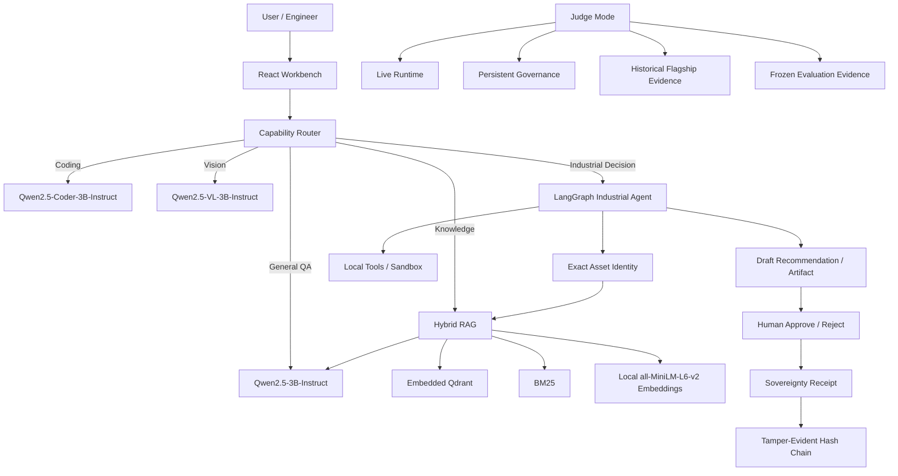

# Sovereign AI

**On-Premise Agentic AI Workbench for Confidential Industrial Intelligence**  
**Problem Statement:** PS 26117

Sovereign AI is a local-first industrial AI workbench designed for confidential engineering workflows involving P&IDs, inspection reports, operating procedures, sensor data, equipment manuals, vendor correspondence, calculations, code generation, and governed decision support.

The platform combines local open-weight models, hybrid retrieval, LangGraph orchestration, sandboxed tools, exact asset identity checks, human approval/rejection, cryptographic Sovereignty Receipts, a tamper-evident receipt chain, and a read-only Judge Mode that separates live runtime evidence from historical evaluation evidence.

> **Core principle:** an AI recommendation is not a human authorization.

> **Sovereignty scope:** Sovereign AI enforces an application-level local network boundary for agent/model execution. It is designed for on-premises and offline deployments, but it does **not** claim whole-machine air-gap certification.

---

## Table of Contents

- [What Sovereign AI Does](#what-sovereign-ai-does)
- [Current Product Status](#current-product-status)
- [Architecture](#architecture)
- [Execution Modes](#execution-modes)
- [Local Models](#local-models)
- [Hybrid RAG](#hybrid-rag)
- [Industrial Agent Workflow](#industrial-agent-workflow)
- [Governance and Human Authorization](#governance-and-human-authorization)
- [Sovereignty Receipt](#sovereignty-receipt)
- [Tamper-Evident Receipt Chain](#tamper-evident-receipt-chain)
- [Judge Mode](#judge-mode)
- [Security Boundary](#security-boundary)
- [Measured Evidence](#measured-evidence)
- [Ports](#ports)
- [Quick Start](#quick-start)
- [Demo Queries](#demo-queries)
- [Project Layout](#project-layout)
- [Testing](#testing)
- [Known Limitations](#known-limitations)
- [What We Do Not Claim](#what-we-do-not-claim)

---

## What Sovereign AI Does

Sovereign AI provides five distinct local execution paths instead of treating every request as the same chatbot task.

| Workload | Execution path |
|---|---|
| General questions | Qwen2.5-3B-Instruct |
| Grounded knowledge questions | Hybrid Qdrant + BM25 retrieval → Qwen2.5-3B-Instruct |
| Coding and debugging | Qwen2.5-Coder-3B-Instruct |
| P&ID / image analysis | Qwen2.5-VL-3B-Instruct |
| Multi-step industrial maintenance decisions | LangGraph industrial agent + identity + RAG + tools + artifact + governance |

The Workbench deliberately distinguishes **routing** from **actual execution**. A router decision never counts as proof that a model actually ran.

### Key capabilities

- Local open-weight model serving through `llama-cpp-python`
- General QA, coding, vision, knowledge/RAG, and industrial-agent workflows
- Exact asset identity verification before industrial retrieval
- Hybrid semantic + lexical retrieval with source provenance
- Local calculations and sandboxed code execution
- DOCX/XLSX/PPTX-capable artifact tooling
- Persistent human approval/rejection records
- Artifact-integrity verification before terminal human decisions
- Sovereignty Receipt generation
- Tamper-evident local receipt hash chain
- Application-level NetworkGuard with external-call accounting
- Read-only Judge Mode for competition/demo evidence

---

## Current Product Status

The current demo host has all three primary local model roles provisioned and validated through the Workbench:

- **General:** online
- **Coder:** online
- **Vision:** online
- **Hybrid RAG:** operational
- **Industrial LangGraph workflow:** operational
- **Human approval/rejection:** persistent
- **Sovereignty Receipt:** operational
- **Receipt hash chain:** operational
- **Judge Mode:** operational

The latest product-freeze acceptance validated:

- General QA without industrial-workflow contamination
- RAG QA with local evidence and General synthesis
- Cross-document RAG
- Industrial workflow dispatch
- Coder routing
- Vision routing
- Honest separation of routing vs actual execution
- Honest separation of RAG intent vs actual retrieval
- No HTTP 500 errors in the final six-query acceptance sequence
- `3/3` primary model services reported online on the validated demo host

---

## Architecture



### Technology stack

| Layer | Technology |
|---|---|
| Frontend | React 18 + TypeScript + Vite + Tailwind CSS |
| Backend | Python 3.11 + FastAPI + Pydantic + Uvicorn |
| Agent orchestration | LangGraph / LangChain |
| Model runtime | `llama-cpp-python 0.3.35` |
| Vector retrieval | Embedded Qdrant |
| Lexical retrieval | `bm25s` |
| Embeddings | local `all-MiniLM-L6-v2`, 384 dimensions |
| Document parsing | PyMuPDF, python-docx, openpyxl, python-pptx |
| OCR | PaddleOCR support in the ingestion/tooling stack |
| Governance store | SQLite (`data/governance/approvals.sqlite3`) |
| Optional relational service | PostgreSQL |
| Optional external sandbox adapter | Piston |

> **Reranking:** the currently validated production RAG path does **not** use an active validated reranker. Retrieval is Qdrant + BM25 weighted hybrid fusion.

---

## Execution Modes

### Auto

Auto mode classifies the request and dispatches it to the appropriate local capability.

- Generic conceptual request → General model
- Knowledge/document question → Hybrid RAG + General synthesis
- Coding task → Coder model
- Image-attached analysis → Vision model
- Multi-signal industrial decision request → Industrial LangGraph workflow

### Knowledge

Knowledge mode performs local retrieval and grounded synthesis:

```text
Question
  ↓
Hybrid Qdrant + BM25
  ↓
Source evidence
  ↓
General model
  ↓
Grounded answer + evidence metadata
```

It does **not** secretly invoke the specialized maintenance agent.

### Coding

Coding requests use the dedicated Qwen Coder runtime and local sandbox/tooling.

### Vision

Vision requests require actual image/PDF input. Merely mentioning terms such as “P&ID” does not falsely create image modality.

---

## Local Models

| Role | Model | Endpoint | Local weight path |
|---|---|---|---|
| General | Qwen2.5-3B-Instruct Q4_K_M | `http://127.0.0.1:8001/v1` | `models/qwen-general/qwen2.5-3b-instruct-q4_k_m.gguf` |
| Coder | Qwen2.5-Coder-3B-Instruct Q4_K_M | `http://127.0.0.1:8002/v1` | `models/qwen-coder/qwen2.5-coder-3b-instruct-q4_k_m.gguf` |
| Vision | Qwen2.5-VL-3B-Instruct Q4_K_M | `http://127.0.0.1:8003/v1` | `models/qwen-vision/Qwen2.5-VL-3B-Instruct-Q4_K_M.gguf` |
| Vision projector | Qwen2.5-VL mmproj Q8_0 | local | `models/qwen-vision/mmproj-Qwen2.5-VL-3B-Instruct-Q8_0.gguf` |
| Embeddings | all-MiniLM-L6-v2 | local filesystem | `models/embeddings/all-MiniLM-L6-v2` |

Model weights are intentionally kept out of Git.

### Validated host

The development/demo host uses:

- NVIDIA GeForce RTX 4050 Laptop GPU, 6 GB VRAM
- AMD Ryzen 5 5600G
- Python 3.11.9 (`sovereign-ai` Conda environment)
- CUDA-enabled `llama-cpp-python 0.3.35`

Coder and Vision CUDA execution were historically validated on this hardware. The current demo host can expose all three model services, but 6 GB VRAM provides tight headroom; heavy concurrent inference should not be generalized beyond the tested workload.

---

## Hybrid RAG

The authoritative RAG path is implemented in:

```text
backend/rag/retrieval/hybrid.py
```

It combines:

- **Dense semantic search:** embedded Qdrant
- **Lexical search:** BM25
- **Fusion:** normalized weighted fusion
  - semantic weight: `0.7`
  - BM25 weight: `0.3`
- **Embedding model:** local `all-MiniLM-L6-v2`
- **Vector dimension:** 384
- **Collection:** `sovereign_knowledge`

Current demo data contains **393 indexed chunks**.

Every retrieved result preserves metadata such as:

- asset tag
- document type
- source file
- data origin
- chunk ID
- section
- retrieval mode

If the local embedding model is unavailable, the retriever can degrade honestly to `bm25_only`; it does not pretend lexical-only retrieval is full hybrid retrieval.

### No active validated reranker

A reranker is **not** part of the validated active retrieval path. Do not interpret stale registry/config placeholders as proof of active reranking.

---

## Industrial Agent Workflow

The industrial workflow is intentionally separate from normal chat and normal RAG QA.

A request with clear multi-step industrial decision intent can execute:

```text
Request
  ↓
Asset Identity
  ↓
Hybrid Retrieval
  ↓
Evidence Analysis
  ↓
Local Calculations / Tools
  ↓
Decision Synthesis
  ↓
Draft Artifact
  ↓
Human Review Required
```

### Flagship R-1001 workflow

Committed historical flagship evidence records:

- Asset: `R-1001`
- Asset identity: `VERIFIED`
- Retrieval mode: `hybrid`
- Retrieved chunks: `36`
- Source files: `7`
- Threshold-breach analysis: performed
- Inspection evidence: included
- Vendor evidence: included
- SOP evidence: included
- Sandbox calculation: used
- Human approval required: `true`
- Draft DOCX artifact: created
- Artifact verification: passed
- External calls recorded: `0`
- Flagship validation: `14/14`

This is committed historical validation evidence and should not be confused with a live run performed at README render time.

---

## Governance and Human Authorization

Sovereign AI separates the AI recommendation from the human decision.

Persistent approval records support:

```text
PENDING → APPROVED
PENDING → REJECTED
```

Terminal decisions do not transition back to `PENDING`.

Before a terminal decision is accepted, the stored artifact SHA-256 is checked against the current artifact. A mismatch blocks the transition.

### API

```text
GET  /api/approvals/pending
GET  /api/approvals/{run_id}
POST /api/approvals/{run_id}/approve
POST /api/approvals/{run_id}/reject
```

### Important governance semantics

- Reviewer IDs are currently self-asserted strings.
- `reviewer_identity_verified` is not an external identity proof.
- Human approval does **not** rewrite the generated DOCX into a falsely “final” document.
- The artifact remains a DRAFT recommendation; approval/rejection metadata is stored separately as governance evidence.

---

## Sovereignty Receipt

A terminal human decision creates a **Sovereignty Receipt** in the same governance transaction.

A receipt binds evidence such as:

- run ID
- asset identity
- AI recommendation metadata
- human decision
- artifact SHA-256
- retrieval evidence summary
- routing information
- explicit model-execution evidence when available
- network/external-call evidence
- sovereignty metadata

Receipt payloads are canonicalized and hashed with SHA-256.

### API

```text
GET /api/receipts/{run_id}
GET /api/receipts/{run_id}/verify
```

Pending approvals do not have terminal receipts.

---

## Tamper-Evident Receipt Chain

Terminal receipts are appended to a local SHA-256-linked history.

Each chain entry binds:

- sequence number
- run ID
- receipt ID
- receipt SHA-256
- approval status
- timestamp
- previous chain hash
- current chain hash

The chain can detect broken links, altered receipt bindings, invalid self-hashes, missing entries, sequence gaps, and unlinked receipts.

### API

```text
GET /api/receipt-chain
GET /api/receipt-chain/head
GET /api/receipt-chain/verify
GET /api/receipt-chain/{run_id}
```

The chain is **tamper-evident**, not tamper-proof. An unrestricted administrator with full database write access could rewrite local history; an external trust anchor or digital signature would be required for stronger guarantees.

---

## Judge Mode

Judge Mode is a read-only evidence surface designed to show what is live, what is persistent, what is historical, and what is unavailable.

It separates evidence into explicit source types:

- `LIVE`
- `LIVE_PERSISTENT`
- `COMMITTED_HISTORICAL_EVIDENCE`
- `FROZEN_EVALUATION_SNAPSHOT`
- `UNAVAILABLE`

Judge Mode shows:

- live model/runtime health
- GPU state
- embedded Qdrant / BM25 state
- current external-call counters
- pending human reviews
- terminal decisions
- receipt verification
- receipt-chain verification
- routing vs actual model execution
- historical flagship evidence
- frozen benchmark evidence
- explicit claim boundaries

### API

```text
GET /api/judge/overview
GET /api/judge/runs/{run_id}
GET /api/judge/flagship
GET /api/judge/evaluation
```

Judge Mode contains no approval/rejection mutation endpoints.

---

## Security Boundary

### NetworkGuard

`backend/agent/security/netguard.py` enforces the application-level network boundary used by agent execution.

Allowed destinations are limited to:

- loopback: `127.0.0.0/8`, `::1`
- RFC1918 private networks:
  - `10.0.0.0/8`
  - `172.16.0.0/12`
  - `192.168.0.0/16`

External and special-use destinations are blocked, including cloud-metadata/link-local ranges and hostnames that would require external DNS resolution.

### No cloud fallback

If a required local model runtime is unavailable, the execution path returns an honest unavailable/failure state. It does not silently call a cloud model.

### What `0 external calls` means

When a validated workflow reports `external_calls = 0`, it means the application-level guarded workflow recorded no external network calls during that run. It is not a certification that the entire operating system or physical machine was air-gapped.

---

## Measured Evidence

### Frozen RAG benchmark

A committed frozen evaluation snapshot records:

| Metric | Result |
|---|---:|
| Hit@1 | `2/6` |
| Hit@3 | `4/6` |
| Hit@5 | `6/6` |
| MRR | `0.5556` |
| Primary-source@1 | `2/6` |
| Foreign asset hits | `0` |

Interpretation: the benchmark recovered the expected primary evidence for all six benchmark questions within the top five, with complete provenance and zero foreign-asset retrieval; first-rank quality remains an improvement area.

### Other frozen evaluation evidence

| Category | Result |
|---|---:|
| Industrial Golden | `10/10` |
| Asset Identity | `18/18` |
| Routing | `10/10` |
| Runtime Resilience | `14/14` |
| Sovereignty / Security | `12/12` |
| Artifact / Sandbox | `11/11` |
| Flagship Validation | `14/14` |

These categories are **not** summed into an invented overall score.

### Latest product-freeze validation

The final Workbench/product acceptance reported:

| Validation | Result |
|---|---:|
| Phase 18 routing / execution tests | `21 passed, 0 failed` |
| Flagship regression | `25 passed, 0 failed` |
| Governance + Judge focused regression | `202 passed, 0 failed` |
| Frontend unit tests | `74 passed, 0 failed` |
| TypeScript | PASS |
| ESLint | PASS |
| Vite build | PASS |

---

## Ports

| Service | Port | Purpose |
|---|---:|---|
| Frontend | `3000` | React/Vite Workbench |
| Backend | `8000` | FastAPI API |
| General model | `8001` | Qwen2.5-3B-Instruct |
| Coder model | `8002` | Qwen2.5-Coder-3B-Instruct |
| Vision model | `8003` | Qwen2.5-VL-3B-Instruct |
| Optional Qdrant server | `6333` / `6334` | server-mode API; authoritative agent RAG uses embedded Qdrant |
| Optional PostgreSQL | `5432` | optional relational service |
| Optional Piston | `2000` | optional sandbox adapter |

For local competition/demo operation, model servers should bind to loopback (`127.0.0.1`).

---

## Quick Start

### 1. Activate the validated environment

```powershell
conda activate sovereign-ai
python --version
where.exe python
```

Validated Python version: **3.11.9**.

### 2. Start the General model

```powershell
cd D:\Sovereign_AI
$env:PYTHONPATH = "D:\Sovereign_AI"

python scripts/serve_model.py `
  --model-id general `
  --model-path models/qwen-general/qwen2.5-3b-instruct-q4_k_m.gguf `
  --host 127.0.0.1 `
  --port 8001 `
  --n-gpu-layers 40 `
  --n-ctx 2048
```

### 3. Start the Coder model

```powershell
conda activate sovereign-ai
cd D:\Sovereign_AI
$env:PYTHONPATH = "D:\Sovereign_AI"

python scripts/serve_model.py `
  --model-id qwen-coder `
  --model-path models/qwen-coder/qwen2.5-coder-3b-instruct-q4_k_m.gguf `
  --host 127.0.0.1 `
  --port 8002 `
  --n-gpu-layers 40 `
  --n-ctx 2048
```

### 4. Start the Vision model

```powershell
conda activate sovereign-ai
cd D:\Sovereign_AI
$env:PYTHONPATH = "D:\Sovereign_AI"

python scripts/serve_model.py `
  --model-id qwen-vision `
  --model-path models/qwen-vision/Qwen2.5-VL-3B-Instruct-Q4_K_M.gguf `
  --mmproj models/qwen-vision/mmproj-Qwen2.5-VL-3B-Instruct-Q8_0.gguf `
  --chat-format qwen2-vl `
  --host 127.0.0.1 `
  --port 8003 `
  --n-gpu-layers 99 `
  --n-ctx 2048
```

> On a 6 GB GPU, keep an eye on VRAM. GPU admission serializes inference work, but model residency still consumes memory.

### 5. Start the backend

```powershell
conda activate sovereign-ai
cd D:\Sovereign_AI
$env:PYTHONPATH = "D:\Sovereign_AI\backend;D:\Sovereign_AI"

python -m uvicorn --app-dir backend app.main:app `
  --host 127.0.0.1 `
  --port 8000
```

API documentation:

```text
http://127.0.0.1:8000/docs
```

### 6. Start the frontend

```powershell
cd D:\Sovereign_AI\frontend
npm install
npm run dev
```

Open:

```text
http://127.0.0.1:3000/workbench
http://127.0.0.1:3000/judge
http://127.0.0.1:3000/system
```

### 7. Verify model services

```powershell
irm http://127.0.0.1:8001/v1/models
irm http://127.0.0.1:8002/v1/models
irm http://127.0.0.1:8003/v1/models
```

The System page probes live runtime state. Do not treat registry configuration alone as proof that a model is online.

---

## Demo Queries

### General QA

```text
What is the difference between preventive and corrective maintenance?
```

Expected path:

```text
GENERAL_QA → General model → no RAG
```

### Grounded RAG

```text
Give me information about the inspection report for R-1001.
```

Expected path:

```text
RAG_QA → Qdrant + BM25 → General synthesis → evidence displayed
```

### Cross-document RAG

```text
Compare the inspection findings with the vendor recommendations for R-1001.
```

### Industrial workflow

```text
Analyze R-1001 operating data and inspection findings, compare them with the
 equipment manual, maintenance SOP and vendor recommendations, determine the
 required corrective action, and prepare a maintenance approval note.
```

Expected path:

```text
Industrial LangGraph workflow
→ asset identity
→ hybrid retrieval
→ calculations/tools
→ governed recommendation
→ draft artifact
→ human review
```

### Coding

```text
Write a Python function to calculate Reynolds number and include a simple test.
```

### Vision

Attach a P&ID image and ask:

```text
Identify the equipment and instrument tags visible in this drawing. Do not guess unreadable tags.
```

---

## Project Layout

```text
Sovereign_AI/
├── README.md
├── Better_plan.md
├── Problem_Statemen.md
│
├── backend/
│   ├── app/
│   │   ├── api/                 # FastAPI routes
│   │   ├── models/              # registry, routing, local model client
│   │   └── storage/
│   ├── agent/                   # LangGraph industrial agent + tools/security
│   ├── governance/              # approvals, receipts, receipt chain
│   ├── judge/                   # Judge Mode aggregation
│   ├── rag/                     # embedded Qdrant + BM25 hybrid retrieval
│   ├── ingestion/               # ingestion subsystem
│   └── tests/
│
├── frontend/
│   └── src/
│       ├── pages/               # Workbench, Judge Mode, System, etc.
│       ├── components/
│       └── lib/                 # typed API client + state
│
├── scripts/
│   ├── serve_model.py           # local OpenAI-compatible GGUF server
│   └── gpu_admission.py         # cross-process GPU admission control
│
├── models/                      # gitignored local weights
│   ├── qwen-general/
│   ├── qwen-coder/
│   ├── qwen-vision/
│   └── embeddings/
│
├── data/
│   ├── rag/                     # embedded Qdrant + BM25 data
│   ├── governance/              # persistent approval / receipt DB
│   ├── outputs/                 # generated artifacts
│   └── synthetic/               # industrial demo corpus
│
├── reports/                     # committed validation evidence
├── demo-data/
├── uploads/
├── PID_Dataset/
├── prerequistes/
└── infra/
```

---

## Testing

Always use the validated Conda environment for backend/project commands:

```powershell
conda activate sovereign-ai
```

### Product routing / execution

```powershell
cd D:\Sovereign_AI\backend
$env:PYTHONPATH = "D:\Sovereign_AI\backend;D:\Sovereign_AI"
pytest -q tests/test_phase18_workbench_routing.py
```

### Flagship regression

```powershell
pytest -q tests/test_phase14b_flagship_workflow.py
```

### Governance and Judge Mode

```powershell
pytest -q `
  tests/test_phase16a_judge_mode_api.py `
  tests/test_phase15c_receipt_hash_chain.py `
  tests/test_phase15b_sovereignty_receipt.py `
  tests/test_phase15a_human_approval.py
```

### Frontend

```powershell
cd D:\Sovereign_AI\frontend
npm test
npx tsc --noEmit
npm run lint
npm run build
```

### Embedded Qdrant test note

The authoritative RAG store is embedded on disk. Do not run a test process against the same embedded Qdrant database while another backend process is actively holding it; stop the live backend first if a test reports a Qdrant lock conflict.

---

## Known Limitations

- The industrial demo corpus is centered primarily on the `R-1001` scenario.
- The flagship P&ID workflow validates one industrial scenario, not every possible engineering drawing.
- Small/dense P&ID labels can still challenge the 3B vision model.
- The active RAG pipeline has no validated reranker; first-rank retrieval quality can improve even though the frozen benchmark recovered all expected primary evidence within top five.
- The current deployment is single-host.
- SQLite governance is local single-host persistence, not a distributed trust system.
- Reviewer identity is self-asserted and not authenticated by an identity provider.
- There is no RBAC layer in the current competition build.
- There is no digital signature or external trust anchor for receipts.
- The receipt chain is tamper-evident, not tamper-proof against an administrator with unrestricted database write access.
- Application-level network controls are validated; whole-machine isolation depends on the deployment environment.
- GPU VRAM is constrained on the validated RTX 4050 host. Three services can be exposed, but arbitrary simultaneous heavy inference is not guaranteed.
- Model weights are not stored in Git and must be provisioned separately.

---

## What We Do Not Claim

To keep the project evidence-based, Sovereign AI does **not** claim:

- whole-machine certified air gap
- blockchain
- tamper-proof storage
- non-repudiation
- digital signatures
- externally anchored receipts
- authenticated reviewer identity
- active production reranking
- perfect RAG ranking
- that routing alone proves model execution
- that historical benchmark evidence is the same thing as live runtime state

---

## Competition Evidence Files

Useful committed evidence lives under `reports/`, including:

- `reports/flagship_workflow_latest.json`
- `reports/competition_scorecard.json`
- `reports/competition_scorecard.md`
- submission claim-ledger / claim-risk reports when present

Judge Mode reads committed historical/frozen evidence separately from live runtime and persistent governance state.

---

## License and Model Weights

This repository contains project code and validation artifacts. Model weights are stored separately and remain subject to the licenses of their upstream model repositories.

Before redistributing a packaged build, verify the licenses for every included model and third-party dependency.

---

## Closing

**Sovereign AI turns confidential industrial evidence into locally generated, provenance-aware, human-governed decisions.**

It does not only present an answer; it is designed to show the asset identity, retrieval evidence, local execution path, tools, human decision, artifact hash, network boundary, receipt, and chain evidence behind that answer.
