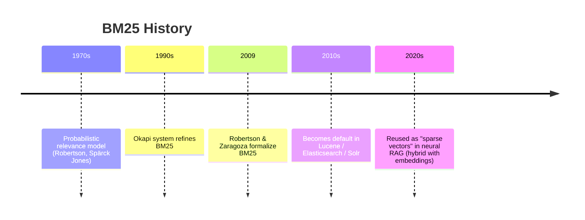
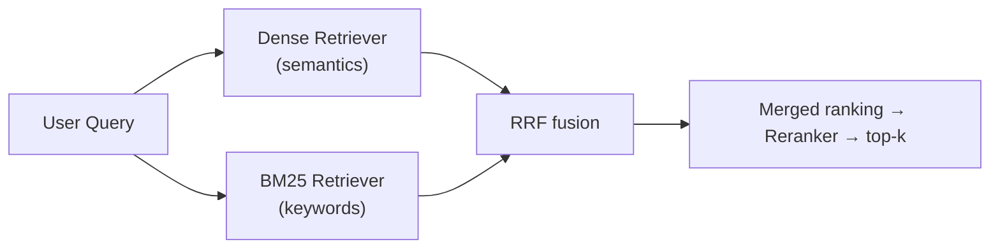
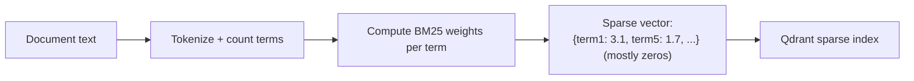
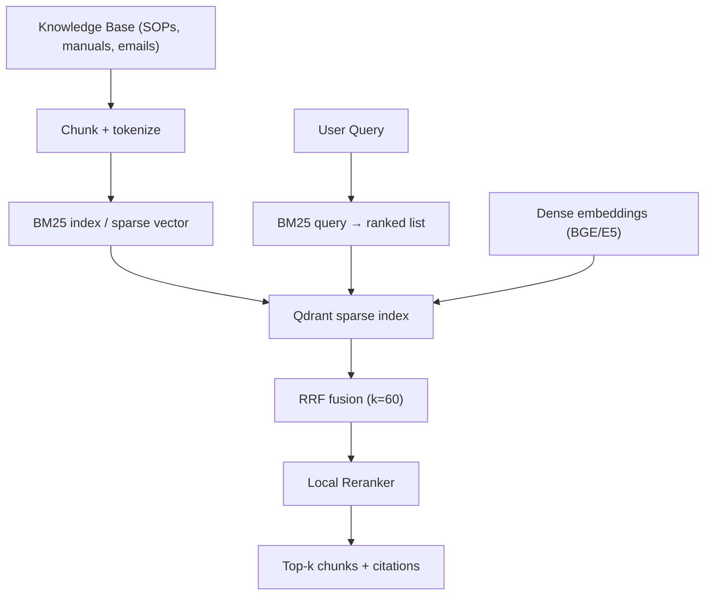

# BM25 --- Sparse Retrieval (Keyword Search) --- Complete Reference

> A plain-English, friend-explainer guide to the **BM25** algorithm used in the Sovereign AI workbench (PS 26117) for sparse/keyword retrieval.
> `Better_plan.md` §2 lists: *"Sparse retrieval: BM25"*. Sources: the Okapi BM25 formulation (Robertson & Zaragoza, 2009) and standard information-retrieval practice, plus Qdrant's sparse-vector docs.

---

## 0. Words & Terms Your Team Mates Should Know (Read This First)

BM25 is not a model — it is a **math formula** that ranks documents by how well they match keywords. These terms explain it.

| Term | Plain-English Meaning |
|---|---|
| **BM25** | Best Matching 25 — a formula that scores how relevant a document is to a keyword query. |
| **Sparse retrieval** | Search by exact keywords (not meaning). Produces a *sparse* vector (mostly zeros). |
| **Keyword search** | Looking for documents that contain the query words. |
| **Document / Corpus** | The collection of texts we search over. |
| **Term / Token** | A single word after splitting text (tokenization). |
| **TF (Term Frequency)** | How many times a word appears in a document. |
| **IDF (Inverse Document Frequency)** | How rare/important a word is across the whole corpus (rare words weigh more). |
| **DF (Document Frequency)** | How many documents contain the word. |
| **Field length / `|D|`** | Number of words in a document; used to avoid favoring long docs. |
| **avgdl** | Average document length in the corpus. |
| **k1** | Parameter controlling term-frequency saturation (typical 1.2–2.0). |
| **b** | Parameter controlling length normalization (typical 0.75). |
| **Saturation** | Diminishing returns: a word appearing 10× isn't 10× more relevant than 2×. |
| **Sparse vector** | A vector that is mostly zeros, with a few non-zero weights at word-index positions. |
| **RRF** | Reciprocal Rank Fusion — merges BM25's ranking with the dense (semantic) ranking. |
| **Qdrant** | Our vector DB; it stores BM25 as a *sparse vector* and fuses it with dense via RRF. |
| **RAG** | Retrieval-Augmented Generation — fetch relevant context, then answer. |
| **PS 26117** | The internal project spec this is used for. |

> Tip for teammates: scan this table first whenever you hit an unknown word.

---

## 1. TL;DR (for you and your friends)

- **What it is:** A classic, fast, math-based **keyword ranking** formula — the engine behind most search bars.
- **Why it's in our stack:** `Better_plan.md` §2/§8 uses **BM25** as the **sparse** half of hybrid RAG — it catches exact matches (part numbers, SOP codes, names) that semantic search may miss.
- **Who invented it:** Stephen Robertson & Hugo Zaragoza (Okapi BM25), building on the probabilistic relevance model from the 1970s–80s; formalized in their 2009 foundational paper.
- **License:** It's a published algorithm (public, free to use).
- **Key strength:** Exact-term precision, zero training, runs instantly — no GPU needed.
- **Sovereignty feature:** Pure math on local data; **no external calls**, no model download.

---

## 2. A. Who "Owns" It

BM25 is an **open academic algorithm**, not a product.

| Attribute | Detail |
|---|---|
| **Authors** | Stephen E. Robertson, Hugo Zaragoza (and the Okapi team before them) |
| **Lineage** | Probabilistic Relevance Model (Robertson/Spärck Jones, 1970s) → Okapi → BM25 |
| **Key paper** | *"The Probabilistic Relevance Framework: BM25 and Beyond"*, 2009 |
| **Status** | Public method, freely usable (basis of Elasticsearch, Lucene, Qdrant sparse, etc.) |

---

## 3. B. History — How It Came To Be



BM25 was the gold standard of search long before AI embeddings. Today it's revived as the **sparse** partner in hybrid search, because it handles exact keywords better than semantic models.

---

## 4. C. What It Does / Why We Need It

Our RAG pipeline runs **two** retrievers:
1. **Dense (embeddings)** — understands meaning.
2. **BM25 (sparse)** — finds exact keywords (IDs, codes, acronyms, names).

Example: a query *"SOP-4471 torque spec"* — the dense model may fuzzy-match, but **BM25 guarantees the literal code `SOP-4471` is found**. RRF then merges both.



---

## 5. D. How It Works (The Math + Architecture)

### 5.1 The Formula

For a document `D` and query `Q`, BM25 sums a score over each query term `t`:

```
            Σ        IDF(t) ·  f(t,D)·(k1 + 1)
score(D,Q)=  t∈Q     ───────────────────────────────────────
                     f(t,D) + k1·(1 − b + b·|D| / avgdl)
```

Where:
- `f(t,D)` = term frequency of `t` in `D`.
- `|D|` = length of `D` in words; `avgdl` = average doc length.
- `k1` ≈ 1.2–2.0 (TF saturation); `b` ≈ 0.75 (length normalization).
- **IDF(t)** = `ln( (N − n_t + 0.5) / (n_t + 0.5) + 1 )`, with `N` = total docs, `n_t` = docs containing `t`.

### 5.2 Worked Example (intuition)

| Factor | Effect |
|---|---|
| Word appears many times in doc | Score rises, but **saturates** (k1 caps it) |
| Word is rare across corpus (high IDF) | Scores higher — rare words are more informative |
| Document is very long | Penalized by `b` factor so long docs don't win unfairly |

### 5.3 How BM25 Becomes a "Sparse Vector"

In modern vector DBs (like Qdrant), BM25 weights are stored as a **sparse vector**: a list of `(term_index, weight)` pairs, mostly zeros.



This lets BM25 plug into the **same fusion pipeline** as dense embeddings — both become ranked lists merged by RRF.

### 5.4 Why BM25 Complements Embeddings

| Strength | BM25 | Dense embeddings |
|---|---|---|
| Exact keyword / code match | ✅ strong | ⚠️ may miss |
| Understanding meaning / synonyms | ⚠️ weak | ✅ strong |
| Needs training / GPU | ❌ none | ✅ model |
| Speed | ⚡ instant | 🐢 heavier |

Hybrid (BM25 + dense + RRF) gets the best of both.

---

## 6. Deployment in the Sovereign AI Stack

In `Better_plan.md` §2/§8, BM25 is the **sparse** retriever fused with dense embeddings via RRF before the reranker.



### 6.1 Configuration Notes

| Setting | Typical |
|---|---|
| `k1` | 1.2 (range 1.2–2.0) |
| `b` | 0.75 |
| Index | Built at ingest; queried live |
| Storage | Qdrant sparse vectors (or a local Lucene/Whoosh index) |
| Location | **Fully local**, no network |

### 6.2 Why It Satisfies Sovereignty

- BM25 is just counting words — no model, no internet, no API.
- Runs entirely on our hardware; network monitor stays at `External AI API calls: 0`.
- Complements local embeddings to give robust, auditable retrieval.

---

## 7. Quick Facts Card (shareable)

```
Algorithm:   BM25 (Best Matching 25)
Authors:     Robertson & Zaragoza (Okapi)
Published:   2009 (probabilistic relevance lineage from 1970s)
Formula:     Σ IDF(t)·(f·(k1+1))/(f + k1·(1−b+b·|D|/avgdl))
Params:      k1≈1.2, b≈0.75
Type:        Sparse / keyword retrieval
Used with:   Dense embeddings + RRF (hybrid RAG)
Role in PS:  Sparse retriever for exact keyword/code matches
Sovereign:   Pure local math, no external calls
```

---

## 8. References

- Robertson & Zaragoza (2009), *The Probabilistic Relevance Framework: BM25 and Beyond*.
- Qdrant sparse vectors / hybrid search: https://qdrant.tech/documentation/concepts/hybrid-search/
- Classic IR texts: Manning, Raghavan, Schütze — *Introduction to Information Retrieval* (BM25 chapter).
