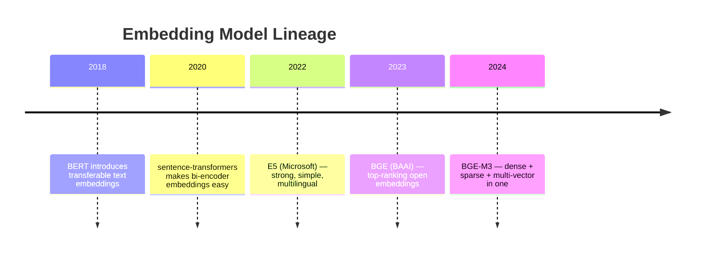
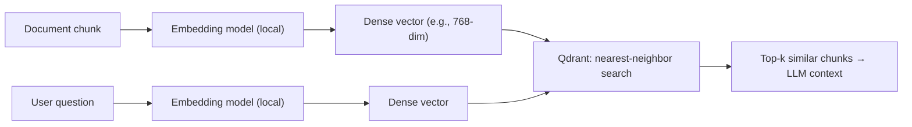
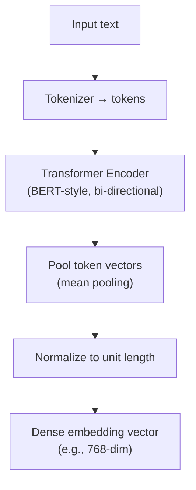
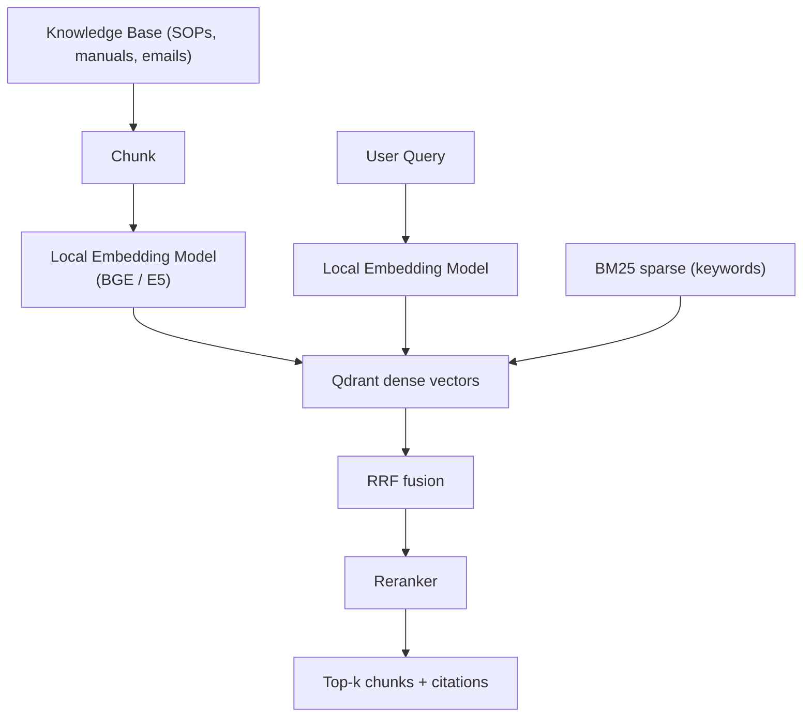

# Local Embeddings (BGE / E5 family) --- Complete Reference

> A plain-English, friend-explainer guide to the **local embedding models** used in the Sovereign AI workbench (PS 26117).
> `Better_plan.md` §2 lists: *"Embeddings: BGE/E5 family, local"*. Everything below is sourced from the BGE (BAAI) and E5 (Microsoft/intfloat) model families' official docs and papers.

---

## 0. Words & Terms Your Team Mates Should Know (Read This First)

"Embeddings" turn text into numbers that capture meaning. These terms explain the concept.

| Term | Plain-English Meaning |
|---|---|
| **Embedding** | A list of numbers (a vector) that represents the *meaning* of a piece of text. |
| **Vector** | Just a list of numbers; similar meanings → numerically similar vectors. |
| **Embedding model** | An AI model that converts text (or images) into embeddings. |
| **Local embedding** | The model runs on **our** hardware, not a cloud API (key for sovereignty). |
| **BGE** | **B**AAI **G**eneral **E**mbedding — a family of open embedding models by BAAI (China). |
| **E5** | A family of open embedding models by Microsoft / intfloat ("EmbEddings from bidirEctional Encoder rEpresentations"). |
| **Bi-encoder** | An embedding model that encodes each text *independently* (fast, used for retrieval). |
| **Transformer encoder** | The neural network type behind these models (same family as BERT). |
| **Pooling** | How token-level vectors are combined into one vector per text (usually mean pooling). |
| **Dimension (dim)** | Length of the vector (e.g., 768, 1024). Bigger often = richer, but more storage. |
| **Dense vector** | The normal embedding (most numbers non-zero) used for semantic search. |
| **Multilingual** | Works across many languages. |
| **BGE-M3** | A BGE model that does dense + sparse + multi-vector in one (great for hybrid RAG). |
| **Normalization** | Scaling the vector to length 1 so cosine similarity = dot product. |
| **Cosine similarity** | A measure of how "aligned" two vectors are (1 = same meaning, 0 = unrelated). |
| **Sentence-Transformers / TEI / vLLM** | Tools to run embedding models locally and serve them via an API. |
| **RAG** | Retrieval-Augmented Generation — embed docs + query, retrieve similar chunks, then answer. |
| **Qdrant** | Our vector DB that stores these embeddings and searches them. |
| **PS 26117** | The internal project spec this is used for. |

> Tip for teammates: scan this table first whenever you hit an unknown word.

---

## 1. TL;DR (for you and your friends)

- **What it is:** Embedding models turn text into vectors so a computer can measure *meaning similarity*.
- **Why it's in our stack:** `Better_plan.md` §2/§8 uses **local BGE/E5 embeddings** to power the **dense** side of hybrid RAG — every document chunk and every user question is embedded and stored in Qdrant.
- **Who made them:** **BGE** by BAAI (Beijing Academy of Artificial Intelligence); **E5** by Microsoft / intfloat.
- **License:** Both families are **open-weight** (mostly Apache 2.0 / MIT). Fully usable locally.
- **How we run it:** Self-hosted on our machine (e.g., via `sentence-transformers`, Hugging Face `transformers`, or a local TEI/vLLM embedding server) — **no cloud API**.
- **Sovereignty feature:** Runs 100% offline; the network monitor shows `External AI API calls: 0`.

---

## 2. A. Who "Owns" Them

| Family | Owner / Lab | License (typical) | Notable models |
|---|---|---|---|
| **BGE** | BAAI (Beijing Academy of Artificial Intelligence) | Apache 2.0 | bge-base-en, bge-large-en, bge-m3, bge-multilingual |
| **E5** | Microsoft / intfloat | MIT / Apache 2.0 | e5-small/base/large, multilingual-e5, e5-mistral-7b (instruct) |

Both are **open-weight**, meaning we download the weights once and serve them locally — no per-call fees, no data leaving the boundary.

---

## 3. B. History — How Embedding Models Evolved



The shift from *cloud* embedding APIs to *local* open models is exactly what lets a sovereign system keep data private while still doing semantic search.

---

## 4. C. What It Does / Why We Need It

To search by **meaning** (not just keywords), we:
1. Split each document into chunks.
2. Embed each chunk → a dense vector.
3. Embed the user's question → a vector.
4. Find chunks whose vectors are closest to the question (Qdrant does this with HNSW).



---

## 5. D. Architecture & How It Works

### 5.1 Bi-Encoder Design

Both BGE and E5 are **bi-encoders**: the query and the document are encoded *separately* into vectors, then compared by distance. This is what makes retrieval fast (you pre-compute document vectors once).



### 5.2 Training Tricks (why they're good)

- **Contrastive / in-batch negative learning**: the model learns to pull matching texts close and push non-matching texts apart.
- **E5** uses a simple prompt format: prefix texts with `"query: "` or `"passage: "`.
- **BGE** uses a retrieval-oriented training recipe (MTP / C-MTP) and often adds a **retrieval-oriented instruction**.
- **BGE-M3** unifies three modes: **dense**, **sparse** (learned lexicon weights), and **multi-vector** (late-interaction, ColBERT-style) — ideal for our hybrid pipeline.

### 5.3 Typical Specs

| Model | Dimensions | Languages | Notes |
|---|---|---|---|
| bge-base-en | 768 | English | Fast, strong baseline |
| bge-large-en | 1024 | English | Higher accuracy |
| bge-m3 | 1024 | 100+ | Dense + sparse + multi-vector |
| multilingual-e5-base | 768 | 100+ | Great for multilingual KB |
| e5-large-v2 | 1024 | English | Strong MTEB scores |

### 5.4 Why Local (not a cloud API)

| Cloud embedding API | Local BGE/E5 |
|---|---|
| Sends your text to a vendor | Text never leaves our machine |
| Per-call cost / rate limits | Free after download, no limits |
| Needs internet at query time | Works fully offline |
| **Breaks sovereignty** | **Preserves sovereignty** |

---

## 6. Deployment in the Sovereign AI Stack

In `Better_plan.md` §2/§8, local embeddings feed **both** document ingestion and query time, and combine with BM25 via RRF.



### 6.1 Operational Notes

- Serve embeddings via a local embedding server (sentence-transformers, HF transformers, or TEI/vLLM) inside Docker Compose.
- Pre-compute document embeddings at ingest; only the query is embedded live.
- Pick dimension to balance quality vs Qdrant RAM (quantization cuts memory further).
- All processing is on-host → network monitor stays at `External AI API calls: 0`.

---

## 7. Quick Facts Card (shareable)

```
Component:  Local Embeddings (dense)
Families:   BGE (BAAI) + E5 (Microsoft/intfloat)
License:    Open-weight (Apache 2.0 / MIT)
Type:       Bi-encoder transformer, mean pooling, normalized
Dimensions: 768 / 1024 typical
Multilingual: yes (BGE-M3, multilingual-e5)
Runs:       Locally (sentence-transformers / TEI / vLLM)
Role in PS: Dense vectors for hybrid RAG (with BM25 + RRF)
Sovereign:  Offline, no cloud embedding calls
```

---

## 8. References

- BGE: https://github.com/FlagOpen/FlagEmbedding (BAAI)
- E5: https://huggingface.co/intfloat (Microsoft/intfloat)
- Sentence-Transformers: https://www.sbert.net/
- BGE-M3 paper (Muennighoff et al., 2024)
- E5 paper (Wang et al., 2022, "Text Embeddings by Microsoft")
