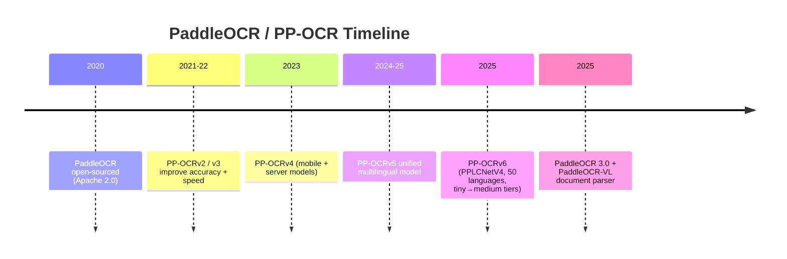
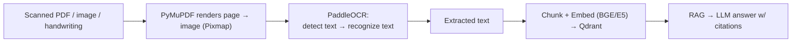
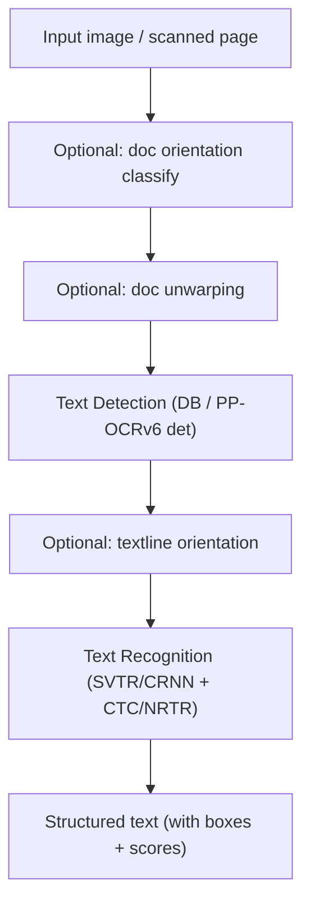

# PaddleOCR --- OCR Engine --- Complete Reference

> A plain-English, friend-explainer guide to the **PaddleOCR** OCR engine used in the Sovereign AI workbench (PS 26117).
> `Better_plan.md` §2 lists: *"OCR: PaddleOCR"* (local OCR for scanned PDFs/images). Sources: official `PaddlePaddle/PaddleOCR` GitHub repo, PaddleOCR 3.0 Technical Report (arXiv:2507.05595), and the PaddleOCR docs site.

---

## 0. Words & Terms Your Team Mates Should Know (Read This First)

OCR = "Optical Character Recognition" — turning images of text into actual text. These terms explain PaddleOCR.

| Term | Plain-English Meaning |
|---|---|
| **OCR** | Reading text out of an image or scanned page and returning it as characters. |
| **PaddleOCR** | An open-source OCR toolkit by the PaddlePaddle (Baidu) team. |
| **PaddlePaddle** | Baidu's deep-learning framework; PaddleOCR models run on top of it. |
| **PP-OCR** | The OCR model family inside PaddleOCR (v3 → v4 → v5 → v6). |
| **Text detection** | Finding where text is on the image (drawing boxes around words/lines). |
| **Text recognition** | Reading the actual characters inside each detected box. |
| **Detection + Recognition** | The two-stage OCR pipeline (find text, then read it). |
| **DB (Differentiable Binarization)** | The common detection algorithm used in PP-OCR. |
| **SVTR / CRNN** | Recognition model architectures used for reading text. |
| **CTC / NRTR** | Decoding methods that turn model output into text. |
| **Backbone** | The core neural network (e.g., PPLCNetV4) that extracts features. |
| **Pixmap** | A rendered image of a page (PyMuPDF produces this before OCR). |
| **Multi-language** | Recognizes many languages in one model (PP-OCRv6: 50 languages unified). |
| **Scanned PDF** | A PDF that is just images of pages (no real text) — needs OCR. |
| **Local / offline** | Runs on our machine; no cloud OCR service. |
| **Air-gap caveat** | Model weights download once from the internet; pre-stage them for full offline use. |
| **RAG** | Retrieval-Augmented Generation — OCR'd text becomes searchable context. |
| **Apache 2.0** | A permissive open-source license (commercial OK). |
| **PS 26117** | The internal project spec this tool is used for. |

> Tip for teammates: scan this table first whenever you hit an unknown word.

---

## 1. TL;DR (for you and your friends)

- **What it is:** An open-source **OCR toolkit** that reads text from images and scanned documents.
- **Why it's in our stack:** `Better_plan.md` §2/§9.1 uses **PaddleOCR** for **local OCR** — turning scanned PDFs, handwritten notes, and images into text that then enters the RAG pipeline. This is our replacement for any cloud OCR service.
- **Who made it:** The **PaddlePaddle team (Baidu)**.
- **License:** **Apache 2.0** (fully open, commercial OK).
- **Speed/size:** The PP-OCRv6 models are tiny (1.5M–34.5M params), run on CPU or GPU, and are faster + more accurate than much larger vision-language models for pure OCR.
- **Sovereignty feature:** Runs 100% locally; no cloud OCR calls → satisfies the "NO CLOUD OCR" rule in §12.3.

---

## 2. A. Who Owns It

| Attribute | Detail |
|---|---|
| **Owner / Maintainer** | **PaddlePaddle team (Baidu)** |
| **Repository** | https://github.com/PaddlePaddle/PaddleOCR |
| **License** | **Apache 2.0** |
| **Framework** | PaddlePaddle deep-learning framework |
| **Stars** | ~88k (one of the most popular OCR projects) |
| **Notable users** | Dify, RAGFlow, Cherry Studio (RAG ecosystems) |

---

## 3. B. History — How It Evolved



PaddleOCR became the default local OCR for RAG because it is accurate, lightweight, multilingual, and fully offline-capable.

---

## 4. C. What It Does / Why We Need It

Our pipeline must handle **scanned** documents (no embedded text). PyMuPDF renders each page to an image; PaddleOCR reads the text.



Also covers: handwritten notes (image → OCR fallback) and engineering drawings where text labels matter (per §9.1).

---

## 5. D. Architecture & Internals

### 5.1 The PP-OCR Pipeline

PaddleOCR's OCR is a **two-stage** pipeline, with optional preprocessing stages.



Stages:
1. **Document orientation classification** (optional) — rotate if upside-down.
2. **Document unwarping** (optional) — fix curved/fisheye scans.
3. **Text detection** — locate text regions (PP-OCRv6 uses RepLKFPN neck + DiceBCE loss).
4. **Textline orientation** (optional) — fix rotated lines.
5. **Text recognition** — read characters (PP-OCRv6 uses PPLCNetV4 backbone + LightSVTR neck + CTC/NRTR heads).

### 5.2 PP-OCRv6 Model Family

| Tier | Params | Target | Languages |
|---|---|---|---|
| **tiny** | 1.5M | edge/IoT | 49 |
| **small** | ~? | mobile/desktop | 50 |
| **medium** | 34.5M | server | 50 (CN/EN/JP + 46 Latin) |

Medium tier: 86.2% detection H-mean, 83.2% recognition accuracy — and it **beats much larger VLMs** (e.g., Qwen3-VL-235B, GPT-class) on OCR while being orders of magnitude smaller.

### 5.3 Key Architectural Pieces (PP-OCRv6)

- **PPLCNetV4 backbone** — MetaFormer-style block with structural reparameterization.
- **RepLKFPN** — detection neck with large-kernel (7×7) dilated convolutions.
- **EncoderWithLightSVTR** — recognition neck with local + global attention.
- **Multi-head decoder** — CTC (fast) + NRTR (auxiliary).
- **Task-adaptive downsampling** — same backbone serves detection and recognition via different strides.

### 5.4 Languages & Output

- **PP-OCRv6**: 50 languages in one unified model (no model switching).
- **PaddleOCR overall**: 100+ languages supported across the toolkit.
- Output: plain text, plus boxes, line/word coordinates, and confidence scores; can emit **JSON / Markdown** for LLM ingestion.
- Newer **PaddleOCR-VL (0.9B)** is a document-parsing VLM (tables, formulas, charts) — an optional upgrade path, but our plan uses the PP-OCR toolkit for OCR.

---

## 6. Deployment in the Sovereign AI Stack

In `Better_plan.md` §2/§9.1, PaddleOCR is the **local OCR** step for the multimodal/multilingual ingestion path.

```mermaid
flowchart TD
    UP["Upload scanned PDF / image"] --> REN["PyMuPDF: render page → Pixmap"]
    REN --> O["PaddleOCR (PP-OCRv6, local)"
    O --> TXT["Text + coordinates"]
    TXT --> CH["Chunker (keep page/section metadata)"]
    CH --> EMB["Local Embeddings (BGE/E5)"]
    EMB --> QD["Qdrant (dense + sparse)"]
    QD --> RAG["RAG → LLM answer w/ citations"]
```

### 6.1 Operational Notes

- Install: `pip install paddlepaddle paddleocr` (CPU build for servers without GPU).
- Run offline: `PaddleOCR(use_doc_orientation_classify=..., use_textline_orientation=...)`.
- Choose the **mobile/tiny** model for CPU-only boxes; **medium** if GPU is free.
- **Air-gap caveat:** PaddleOCR downloads pretrained weights from HuggingFace/BOS on first run. For a true air-gapped deployment, **pre-download the model files** and point the loader at the local path (`PADDLE_PDX_MODEL_SOURCE="bos"` or a local dir). This keeps the runtime offline while still satisfying sovereignty.

### 6.2 Why It Satisfies Sovereignty

- Local execution; no cloud OCR API → meets "NO CLOUD OCR" (§12.3).
- Apache 2.0 license → no usage restrictions.
- With pre-staged weights, the whole OCR step runs with zero external calls; the network monitor shows `External AI API calls: 0`.

---

## 7. Quick Facts Card (shareable)

```
Tool:        PaddleOCR (PP-OCR toolkit)
Owner:       PaddlePaddle team (Baidu)
License:     Apache 2.0
Framework:   PaddlePaddle
Pipeline:    Detect → (optional orient/unwarp) → Recognize
Models:      PP-OCRv6 (tiny 1.5M / small / medium 34.5M)
Languages:   50 unified (toolkit: 100+)
Runs:        Local CPU/GPU, offline (pre-stage weights!)
Role in PS:  Local OCR for scanned PDFs / handwriting / images
Sovereign:   No cloud OCR; Apache 2.0; air-gap = pre-download models
```

---

## 8. References

- Repository: https://github.com/PaddlePaddle/PaddleOCR
- Docs: https://www.paddleocr.ai/
- PaddleOCR 3.0 Technical Report: arXiv:2507.05595
- PP-OCRv6: arXiv:2606.13108 (PPLCNetV4, unified 50-language)
- Model hub: https://huggingface.co/PaddlePaddle (pre-stage for air-gap)
