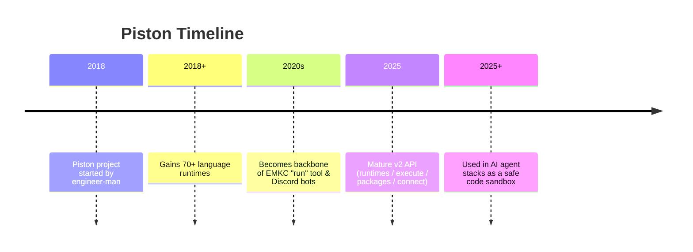
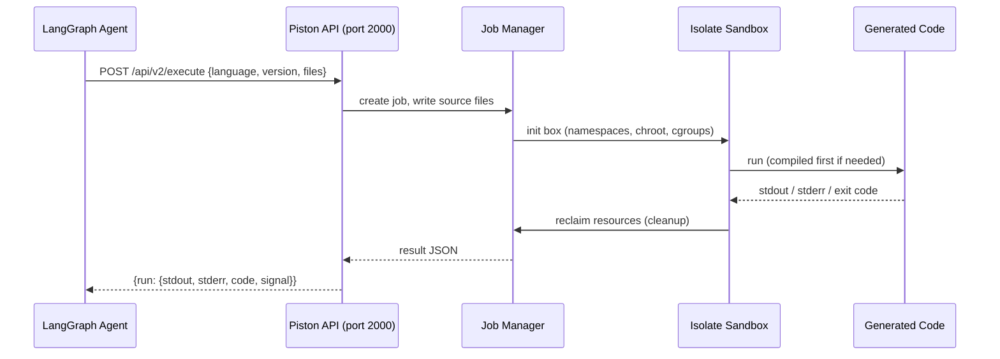
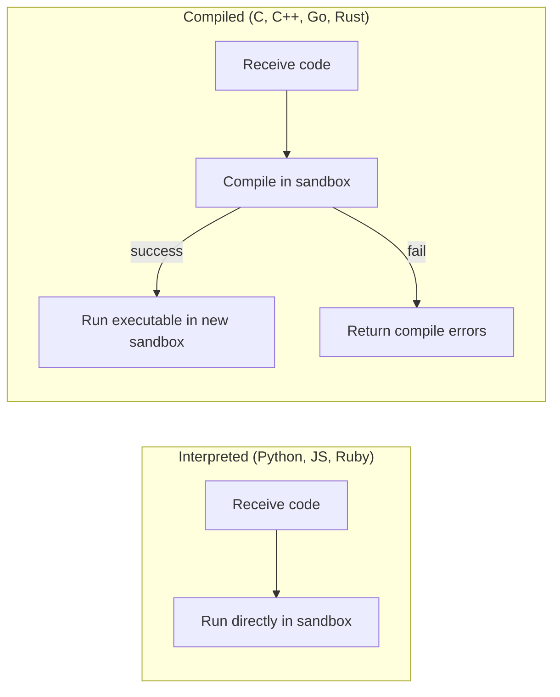
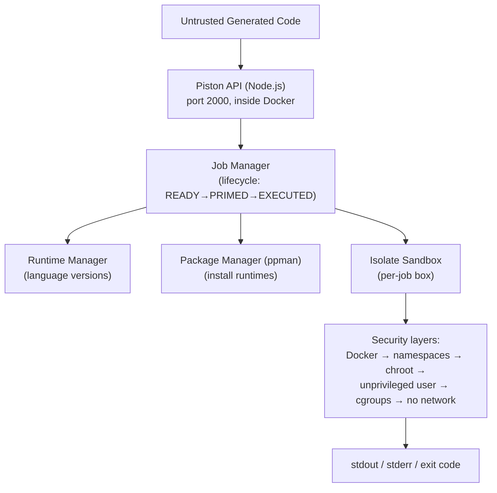
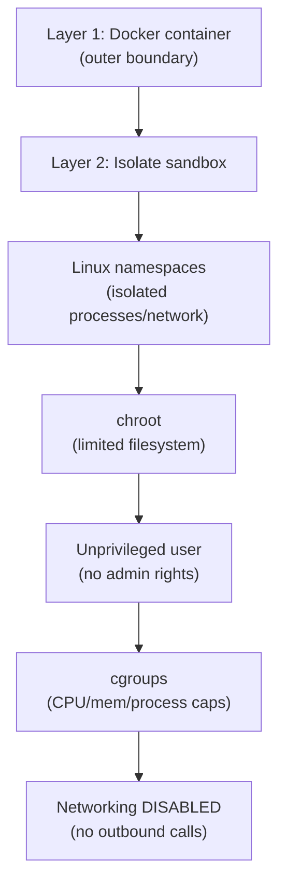
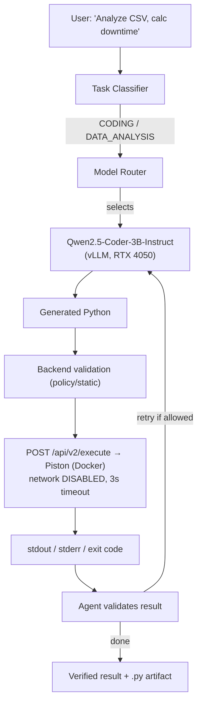

# Piston --- Code Execution Sandbox --- Complete Reference

> A plain-English, friend-explainer guide to the Piston sandbox used in the Sovereign AI workbench (PS 26117).
> Everything below is sourced from the official `engineer-man/piston` GitHub repository, its ReadTheDocs API docs, and the DeepWiki architecture notes.

---

## 0. Words & Terms Your Team Mates Should Know (Read This First)

Piston is not an AI model — it is a **safe code-runner**. These terms explain how it works.

| Term | Plain-English Meaning |
|---|---|
| **Piston** | An open-source engine that runs code sent to it and returns the output — safely. |
| **Sandbox** | An isolated box where untrusted code runs so it cannot harm the real system. |
| **engineer-man** | The creator of Piston (Brandon, known as the "Engineer Man" YouTube channel). |
| **MIT License** | A very permissive open-source license (free to use, modify, even commercially). |
| **Docker** | A tool that packages software into isolated containers. Piston runs inside one. |
| **Container** | A lightweight, isolated environment running one app (here, the Piston API). |
| **Isolate** | The actual sandboxing tool Piston uses (from competitive-programming grading). It builds a locked-down box per run. |
| **Untrusted / malicious code** | Code we don't fully trust (e.g., generated by an LLM). Piston is built to run it safely. |
| **Linux namespaces** | A kernel feature that gives a process its own isolated view of the system (its own files, network, processes). |
| **chroot** | Changing the apparent root folder so the code can't see files outside its box. |
| **cgroups (control groups)** | A kernel feature to limit CPU, memory, and process count for a group of processes. |
| **Unprivileged user** | A non-admin account with no special rights — each run uses a different one. |
| **Runtime** | The installed language environment (e.g., Python 3.12, Node 20) Piston can execute. |
| **Job** | One execution request (run this code, in this language). |
| **REST API** | A web-style interface (send JSON in, get JSON back). |
| **WebSocket** | A persistent two-way connection for interactive (streaming) execution. |
| **Compile vs Interpret** | Compiled languages (C, C++, Go) are built first then run; interpreted ones (Python, JS) run directly. |
| **Resource limit** | A cap (time, memory, processes, output) so a runaway program can't crash the host. |
| **disable_networking** | A setting that blocks the executed code from making any network calls. Critical for our sovereignty. |
| **Port 2000** | The network port the Piston API listens on by default. |
| **vLLM / LLM** | The AI model that *generates* the code; Piston is what *runs* it. |
| **RTX 4050 (6 GB)** | Our server GPU. Piston itself runs on CPU/RAM; the model it serves runs on the GPU. |
| **Sovereign / Air-gapped** | Everything stays on our own hardware; no external cloud calls. |
| **PS 26117** | The internal project spec this tool is used for. |

> Tip for teammates: scan this table first whenever you hit an unknown word.

---

## 1. TL;DR (for you and your friends)

- **What it is:** A high-performance, general-purpose **code execution engine** that runs untrusted code in a secure sandbox.
- **Why it's in our stack:** `Better_plan.md` §10/§2 specifies **Piston + Docker** as the sandbox where the LLM-generated Python/data-analysis code is executed — safely, offline, with no network.
- **Who made it:** **engineer-man** (open-source community project).
- **License:** **MIT** (fully permissive).
- **How we run it:** As a **self-hosted Docker container** inside our Docker Compose stack, on the same machine as the backend.
- **Key sovereignty feature:** Network is **disabled by default** for executed code, so generated code cannot phone home — directly supporting the "no external calls" proof in the network monitor.

---

## 2. A. Who Owns It

| Attribute | Detail |
|---|---|
| **Creator / Owner** | **engineer-man** (Brandon) and contributors |
| **Repository** | https://github.com/engineer-man/piston |
| **License** | **MIT** |
| **Type** | Open-source code execution engine (not an AI model) |
| **Deployment** | Self-hosted via Docker / Docker Compose (we run it locally) |
| **Public hosted API** | `emkc.org/api/v2/piston/*` (rate-limited to 5 req/s) — we do NOT use this; we self-host |

---

## 3. B. History — How It Came To Be



Piston was built to let websites and bots run user-submitted code (including hostile code) without damaging the host. That exact property is why it fits an **agentic AI** system: the LLM produces code, Piston runs it without trusting it.

---

## 4. C. What It Does / How It Works

Piston receives code + language + version, runs it, and returns `stdout`, `stderr`, and exit code. It is the **"hands"** of the agent; the LLM is the "brain".

### 4.1 The Request → Result Flow



### 4.2 Compiled vs Interpreted



---

## 5. D. Architecture & Internals

### 5.1 Layered Architecture

Piston uses a **multi-layered** design: Docker is the outer wall; Isolate is the inner sandbox.



### 5.2 Internal Components

| Component | Responsibility |
|---|---|
| **API service (Node.js)** | Receives requests, manages jobs, returns results. Default port 2000. |
| **Job Manager** | Handles each job lifecycle: create box → write files → run → cleanup. |
| **Isolate Sandbox** | The real isolation layer (Linux namespaces, chroot, cgroups, unprivileged users). |
| **Runtime Manager** | Tracks installed language runtimes and versions. |
| **Package Manager (ppman)** | Installs/manages language packages on demand. |

### 5.3 How "Principle of Operation" Works (official)

> Piston uses **Isolate inside Docker** as the primary mechanism for sandboxing. A Node API inside the container takes execution requests and executes them safely. The API writes the source code and executes it inside an Isolate sandbox. The source file is either run directly (interpreted) or compiled-and-run (C/C++/C#/Go…).

Isolate box lifecycle per job:
1. `isolate --init --cg -b <box_id>` — create a sandboxed directory.
2. Write source/related files with proper permissions.
3. Execute with resource limits.
4. `isolate --cleanup --cg -b <box_id>` — reclaim resources (prevents disk exhaustion attacks).

### 5.4 Isolation / Security Layers



Security guarantees (from the official README):
- Submissions are unaware of and cannot affect each other or the host.
- Outgoing network interaction **disabled by default**.
- Max processes capped (resists fork bombs).
- Max files / file size capped (resists disk-fill attacks).
- Each submission runs as a **different unprivileged user** with its own namespaces.
- Runtime capped (default 3s), memory capped, stdout capped (resists output bombs).
- Misbehaving code is **SIGKILL**ed.

### 5.5 Default Limits (configurable via env vars)

| Parameter | Default | Env Var | Purpose |
|---|---|---|---|
| `disable_networking` | **true** | `PISTON_DISABLE_NETWORKING` | Blocks network for executed code |
| `run_timeout` | 3s | `PISTON_RUN_TIMEOUT` | Max wall time (run) |
| `run_cpu_time` | 3s | `PISTON_RUN_CPU_TIME` | Max CPU time (run) |
| `compile_timeout` | 10s | `PISTON_COMPILE_TIMEOUT` | Max wall time (compile) |
| `compile_cpu_time` | 10s | `PISTON_COMPILE_CPU_TIME` | Max CPU time (compile) |
| `max_process_count` | 64 (README notes 256) | `PISTON_MAX_PROCESS_COUNT` | Resists fork bombs |
| `max_open_files` | 2048 | `PISTON_MAX_OPEN_FILES` | Limits file descriptors |
| `max_file_size` | 10 MB | `PISTON_MAX_FILE_SIZE` | Prevents disk attacks |
| `output_max_size` | 1024 chars | `PISTON_OUTPUT_MAX_SIZE` | Prevents output bombs |
| `max_concurrent_jobs` | 64 | `PISTON_MAX_CONCURRENT_JOBS` | Stability under load |

> **Sovereignty note:** `disable_networking=true` is exactly what keeps the generated code from reaching the internet — reinforcing the `External AI API calls: 0` shown in the network monitor.

### 5.6 API Surface

| Endpoint | Method | Purpose |
|---|---|---|
| `/api/v2/runtimes` | GET | List installed languages + versions |
| `/api/v2/execute` | POST | Run code, return result JSON |
| `/api/v2/connect` | WebSocket | Interactive, streaming execution |
| `/api/v2/packages` | GET / POST / DELETE | List / install / remove runtimes |

Example `POST /api/v2/execute` body:
```json
{
  "language": "python",
  "version": "3.12.0",
  "files": [
    { "name": "main.py", "content": "print('Hello from sandbox')" }
  ]
}
```

Example response (abridged):
```json
{
  "language": "python",
  "version": "3.12.0",
  "run": {
    "stdout": "Hello from sandbox\n",
    "stderr": "",
    "code": 0,
    "signal": null
  }
}
```

### 5.7 Supported Languages

**70+ runtimes**, including the ones our project needs:
- Python (2 & 3), JavaScript/Node, TypeScript
- C, C++, C#, Go, Rust, Java, Kotlin, Swift
- Ruby, PHP, Perl, Bash, Powershell
- SQL (sqlite3), Octave, R (rscript), Julia, Dart, Scala, Haskell, and many more (even esoteric ones like Brainfuck, LOLCODE).

For the Sovereign AI project, the critical runtime is **Python** (for the data-analysis / calculation scripts the coder model generates). Other runtimes can be installed on demand via the package manager.

---

## 6. Deployment in the Sovereign AI Stack

In `Better_plan.md` §2/§10, Piston + Docker is the **secure sandbox** for the coding agent.



### 6.1 Why It Satisfies Sovereignty

- **Self-hosted in our Docker Compose** — no reliance on external execution services.
- **Networking disabled** — generated code cannot exfiltrate data or call external APIs.
- **Resource-limited & isolated** — protects the host from runaway or malicious code.
- The **network monitor** in the UI will still report `External AI API calls: 0` because Piston itself makes no outbound calls, and the code it runs is network-blocked.

### 6.2 Deployment Notes

- Run via `docker run --privileged -p 2000:2000 ghcr.io/engineer-man/piston` or `docker-compose up -d api`.
- Requires **cgroup v2 enabled** and **Node >= 15**.
- Supports x86_64 and ARM64 hosts.
- Optional API key (`PISTON_KEY`) to protect the endpoint.
- Install needed runtimes at startup, e.g. `PISTON_INSTALL_PACKAGES=bash,python=3.12.0,node=20.11.1,gcc`.

---

## 7. Quick Facts Card (shareable)

```
Tool:        Piston (code execution engine)
Owner:       engineer-man (open-source)
License:     MIT
Runs:        Inside Docker, self-hosted, port 2000
Sandbox:     Isolate (namespaces + chroot + cgroups + unprivileged user)
Network:     DISABLED by default for executed code
Limits:      run 3s, cpu 3s, compile 10s, procs 64, output 1024 chars
Languages:   70+ (Python, JS, C/C++, Go, Rust, Java, SQL, ...)
Role in PS:  Secure sandbox that RUNS LLM-generated code (offline)
```

---

## 8. References

- Repository: https://github.com/engineer-man/piston
- API docs: https://piston.readthedocs.io/en/latest/api-v2/
- DeepWiki architecture: https://deepwiki.com/engineer-man/piston
- Isolate tool: https://www.ucw.cz/moe/isolate.1.html
- EMKC public API: https://emkc.org/api/v2/piston/execute (we self-host instead)
