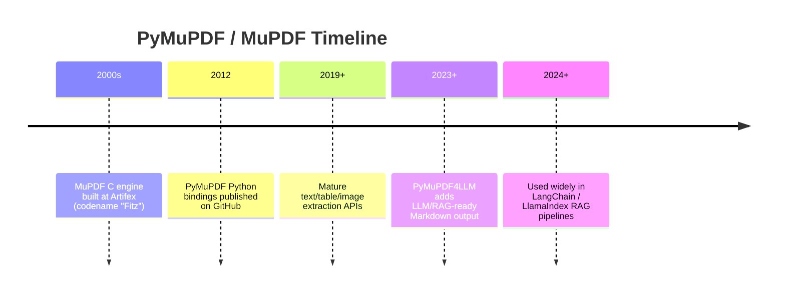
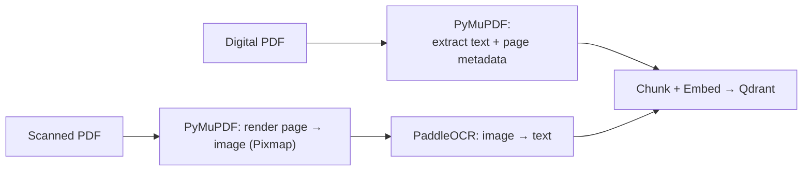
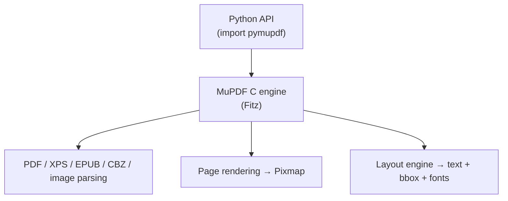
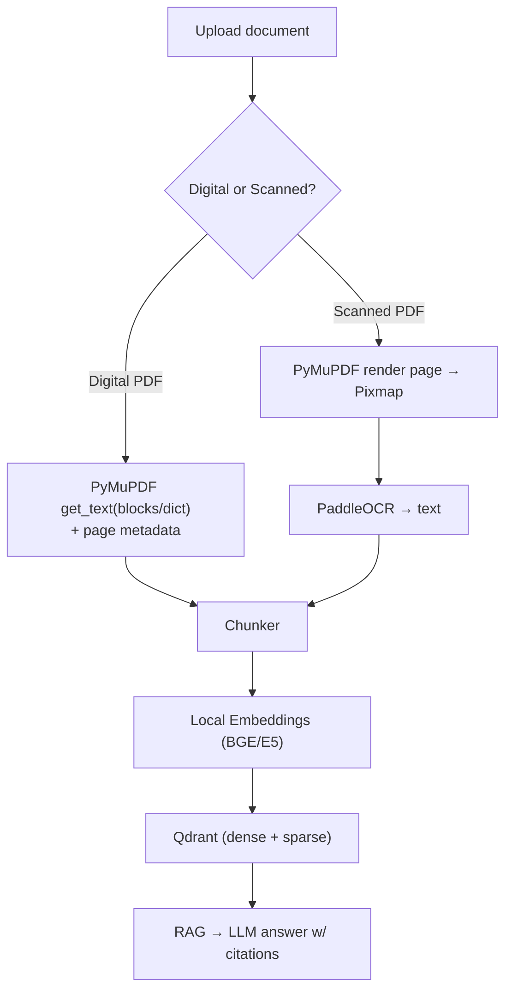

# PyMuPDF --- Document Parser --- Complete Reference

> A plain-English, friend-explainer guide to the **PyMuPDF** document parser used in the Sovereign AI workbench (PS 26117).
> `Better_plan.md` §2 lists: *"Document parser: PyMuPDF"* (digital PDF text + page metadata). Sources: official `pymupdf/PyMuPDF` GitHub repo, ReadTheDocs, and Artifex docs.

---

## 0. Words & Terms Your Team Mates Should Know (Read This First)

PyMuPDF is a **library** (code we call) that reads PDFs and pulls out text, images, and layout. These terms explain it.

| Term | Plain-English Meaning |
|---|---|
| **PyMuPDF** | A fast Python library to read, extract, and edit PDFs and other documents. |
| **MuPDF** | The C engine underneath PyMuPDF — where the real speed comes from. |
| **fitz** | The old import name for PyMuPDF (legacy alias). Use `import pymupdf` now. |
| **Artifex** | The company that maintains MuPDF and PyMuPDF. |
| **Parser** | Code that reads a file's raw bytes and makes sense of its structure. |
| **Text extraction** | Pulling the words out of a PDF as text. |
| **Metadata / page metadata** | Info about the doc/page (page number, title, author, font, position). |
| **Bounding box (bbox)** | The rectangle coordinates of a word/block on the page. |
| **Block / Word / Line / Span** | Levels of layout: block (paragraph) → line → word → span (font run). |
| **Pixmap** | A rendered image of a page (used before OCR on scanned PDFs). |
| **OCR** | Reading text out of an image (PyMuPDF can call Tesseract; we use PaddleOCR downstream). |
| **`get_text()`** | The main function to extract text in many formats. |
| **`find_tables()`** | Detects tables on a page and extracts them. |
| **AGPL v3** | A strong copyleft license (important caveat — see §2). |
| **RAG** | Retrieval-Augmented Generation — we parse docs so the AI can search them. |
| **Markdown (MD)** | A simple text format; PyMuPDF4LLM outputs it for LLM ingestion. |
| **Sovereign / local** | PyMuPDF runs entirely on our machine; no data leaves. |
| **PS 26117** | The internal project spec this tool is used for. |

> Tip for teammates: scan this table first whenever you hit an unknown word.

---

## 1. TL;DR (for you and your friends)

- **What it is:** A high-performance **Python PDF/document parser** (built on the C-based MuPDF engine) that extracts text, tables, images, and layout metadata.
- **Why it's in our stack:** `Better_plan.md` §2/§9.1 uses **PyMuPDF** to parse **digital PDFs** — pulling clean text + page metadata for the RAG pipeline. For **scanned PDFs**, PyMuPDF first *renders each page to an image*, which is then sent to PaddleOCR.
- **Who made it:** **Artifex Software, Inc.** (maintainers of MuPDF).
- **License:** **GNU AGPL v3.0** (open source, but strong copyleft — see the caveat in §2). A separate commercial license is available from Artifex.
- **Speed:** Powered by MuPDF's C engine — up to 10× faster text extraction and 50×+ faster rendering than pure-Python PDF libraries, with a tiny memory footprint.
- **Sovereignty feature:** Runs 100% locally in-process; no network, no data transmitted.

---

## 2. A. Who Owns It (and a License Caveat)

| Attribute | Detail |
|---|---|
| **Owner / Maintainer** | **Artifex Software, Inc.** |
| **Engine** | MuPDF (C library; internal codename historically "Fitz") |
| **Repository** | https://github.com/pymupdf/PyMuPDF |
| **License** | **GNU AGPL v3.0** (open source) |
| **Commercial option** | Paid license from Artifex for proprietary use without AGPL obligations |

> ⚠️ **License caveat for the team:** AGPL v3 is *copyleft*. If we **distribute** the system (including offering it as a network service to users outside our organization), AGPL can require releasing our source. For a purely internal, on-prem deployment this is usually fine, but **legal should review** before any external exposure. The Better_plan.md sovereignty stance ("open-weight") mostly concerns AI models; PyMuPDF's AGPL is a different, stricter class. Note it in the compliance checklist.

---

## 3. B. History — How It Came To Be



PyMuPDF became the de-facto PDF extraction layer for RAG because it is fast (C-backed) and returns rich layout data (positions, fonts) that pure-Python parsers miss.

---

## 4. C. What It Does / Why We Need It

Before any document can be searched semantically, we must turn it into clean text + metadata. PyMuPDF is the **first step** of ingestion.



Two paths (per `Better_plan.md` §9.1):
- **Digital PDF** → PyMuPDF extracts text directly.
- **Scanned PDF** → PyMuPDF renders the page to an image, then PaddleOCR reads it.

---

## 5. D. Architecture & Internals

### 5.1 Layered Design



The Python layer is a **thin, fast bridge** to MuPDF's battle-tested C code — that's why it's quicker than libraries that re-implement PDF parsing in Python.

### 5.2 Text Extraction Formats (`page.get_text(opt)`)

| `opt` | Output | Use in our pipeline |
|---|---|---|
| `"text"` | Plain text, line breaks | Simple chunking |
| `"blocks"` | Paragraph blocks + bboxes | Layout-aware chunking |
| `"words"` | Individual words + positions | Spatial analysis |
| `"dict"` / `"json"` | Blocks/lines/spans + font info | Rich metadata for citations |
| `"rawdict"` | Character-level detail | Precise layout |
| `"html"` / `"xhtml"` | Visual HTML | Web preview |
| `"xml"` | Full position/font XML | Advanced parsing |

### 5.3 Key Capabilities

| Capability | Relevance to Sovereign AI |
|---|---|
| **Text extraction** (font, color, position) | Builds cited, page-aware chunks |
| **`find_tables()`** | Extracts SOP/tables as Markdown/structured data |
| **Image extraction / page rendering (Pixmap)** | Feeds scanned pages to PaddleOCR |
| **Metadata** (title, author, bookmarks, links) | Document provenance |
| **OCR (Tesseract-built-in)** | Optional; we prefer local PaddleOCR per plan |
| **PDF creation/editing** | Could generate annotated artifacts |
| **No mandatory deps** | `pip install pymupdf` — simple, offline |

### 5.4 Supported Formats

- **Documents:** PDF, XPS, EPUB, CBZ, MOBI, FB2, SVG, TXT, MD.
- **Images:** PNG, JPEG, BMP, TIFF, GIF (render/extract).
- **Office:** via `pymupdfpro` (DOCX/XLSX/PPTX) — note: the base library focuses on PDF/ebook/image types; our Office parsing for DOCX/XLSX/PPTX is handled by other tools (python-docx/openpyxl/python-pptx) in the plan.

### 5.5 LLM-Ready Output (PyMuPDF4LLM)

A companion package, **PyMuPDF4LLM**, converts PDFs straight to **Markdown/JSON** with natural reading order and tables — ideal for RAG ingestion. Same AGPL license.

---

## 6. Deployment in the Sovereign AI Stack

In `Better_plan.md` §2/§9.1, PyMuPDF is the **document parser** in the ingestion path.



### 6.1 Operational Notes

- Install: `pip install pymupdf` (and `pymupdf4llm` for Markdown RAG output).
- Use `import pymupdf` (not legacy `import fitz`).
- For scanned PDFs, render at sufficient DPI before OCR; pass the Pixmap to PaddleOCR.
- Runs in-process on the backend host → network monitor stays at `External AI API calls: 0`.

### 6.2 Why It Satisfies Sovereignty

- Entirely local; no cloud parsing service, no data transmission.
- Pairs with **local** PaddleOCR (not a cloud OCR) — meets the "NO CLOUD OCR" rule in §12.3.
- ⚠️ Just keep the **AGPL license** review (§2) on the compliance checklist.

---

## 7. Quick Facts Card (shareable)

```
Tool:        PyMuPDF (document parser)
Owner:       Artifex Software (MuPDF C engine)
License:     GNU AGPL v3.0 (commercial option available)
Language:    Python bindings over C (MuPDF)
Speed:       ~10x text, ~50x render vs pure-Python
Input:       PDF, XPS, EPUB, CBZ, images, more
Output:      text / blocks / dict / json / html / xml / MD
Role in PS:  Digital PDF parsing + page render for OCR
Sovereign:   Fully local; AGPL review needed
```

---

## 8. References

- Repository: https://github.com/pymupdf/PyMuPDF
- Docs: https://pymupdf.readthedocs.io/
- PyMuPDF4LLM (RAG Markdown): https://github.com/pymupdf/pymupdf4llm
- MuPDF / Artifex: https://mupdf.com / https://artifex.com
- License: https://www.gnu.org/licenses/agpl-3.0.html
