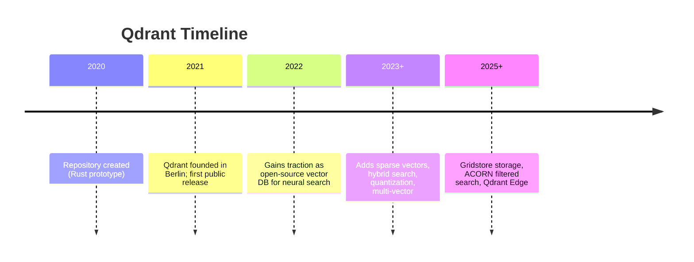
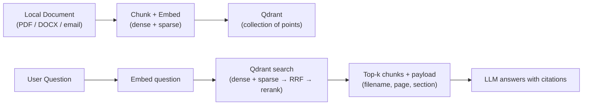
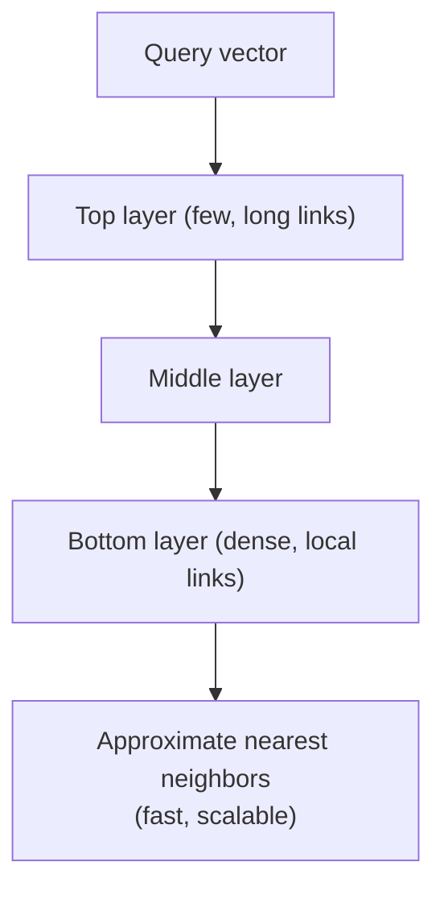
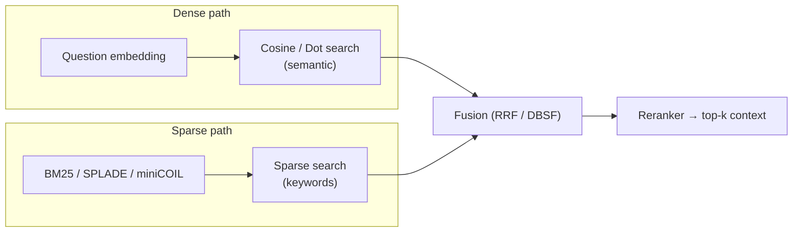
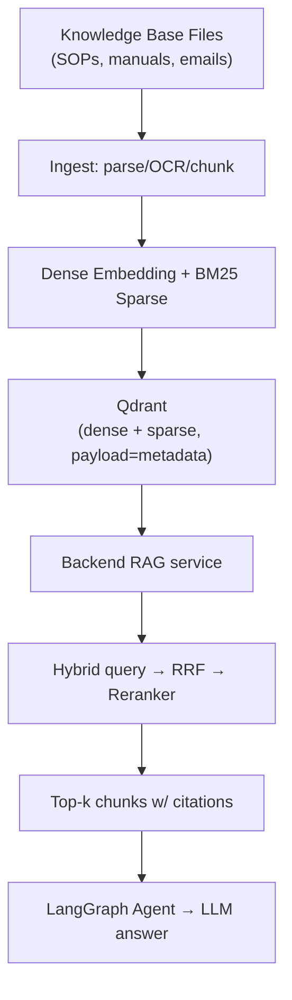

# Qdrant --- Vector Database --- Complete Reference

> A plain-English, friend-explainer guide to the Qdrant vector database used in the Sovereign AI workbench (PS 26117).
> Everything below is sourced from the official `qdrant/qdrant` GitHub repo, the Qdrant documentation site (qdrant.tech), and related deep-dive sources.

---

## 0. Words & Terms Your Team Mates Should Know (Read This First)

Qdrant is not an AI model — it is a **database specialized for similarity search** (a "vector DB"). These terms explain how it works.

| Term | Plain-English Meaning |
|---|---|
| **Qdrant** | A vector database / search engine (pronounced "**quadrant**", the "d" is silent). |
| **Vector DB** | A database that stores "vectors" (lists of numbers) and finds the most similar ones fast. |
| **Embedding / Vector** | A list of numbers produced by an AI model that captures the *meaning* of text/images. Similar meanings → similar vectors. |
| **Point** | One record in Qdrant = a vector + an `id` + optional `payload` (metadata). |
| **Collection** | A named group of points (like a table in a normal database). |
| **Payload** | JSON metadata attached to a point (e.g., filename, page, section) used for filtering. |
| **Similarity search** | Finding the vectors closest to a query vector (by distance). |
| **ANN (Approximate Nearest Neighbor)** | Finding *almost* the closest matches very fast instead of checking every item. |
| **HNSW** | Hierarchical Navigable Small World — the graph algorithm Qdrant uses for fast search. |
| **Dense vector** | A normal embedding (most numbers non-zero) used for semantic/meaning search. |
| **Sparse vector** | A vector that is mostly zeros, used for keyword search (e.g., BM25). |
| **Hybrid search** | Combining dense (meaning) + sparse (keywords) in one query. |
| **RRF (Reciprocal Rank Fusion)** | A method to merge two ranked result lists into one. Used in our RAG pipeline. |
| **Reranker** | A model that re-orders retrieved results to improve relevance. |
| **Quantization** | Compressing vectors (e.g., Scalar, Product, Binary) to use far less RAM. |
| **Payload index** | An index on metadata fields so filters stay fast. |
| **Sharding** | Splitting a collection across multiple nodes/servers for scale. |
| **Raft** | A consensus protocol so multiple nodes agree (used for replication). |
| **Eventual consistency** | Replicas may briefly lag; a just-written value might not appear instantly elsewhere. |
| **GRPC / REST** | Two ways to talk to Qdrant over the network (gRPC is faster; REST is simpler). |
| **SIMD / Gridstore** | CPU acceleration tricks + Qdrant's custom storage engine for speed. |
| **Docker** | Packaging format; we run Qdrant in a container. |
| **RAG** | Retrieval-Augmented Generation — the AI fetches relevant context from Qdrant before answering. |
| **BM25** | A classic keyword-scoring formula (the sparse side of hybrid search). |
| **PS 26117** | The internal project spec this tool is used for. |

> Tip for teammates: scan this table first whenever you hit an unknown word.

---

## 1. TL;DR (for you and your friends)

- **What it is:** A high-performance **vector database** (written in Rust) for storing embeddings and finding similar items by meaning.
- **Why it's in our stack:** `Better_plan.md` §2/§8 lists **Qdrant** as the vector DB for **hybrid retrieval** — it holds the dense embeddings *and* the BM25 sparse indexes, then fuses them (RRF) for RAG over our local knowledge base.
- **Who made it:** **Qdrant Solutions GmbH** (Berlin), founded 2021 by Andre Zayarni and Andrey Vasnetsov.
- **License:** **Apache 2.0** (fully open, commercial OK). Same engine self-hosted or cloud.
- **How we run it:** As a **self-hosted Docker container** (`qdrant/qdrant`) inside our Docker Compose stack — no cloud, fully local.
- **Key sovereignty feature:** 100% local; our documents and embeddings never leave the deployment boundary.

---

## 2. A. Who Owns It

| Attribute | Detail |
|---|---|
| **Owner / Company** | **Qdrant Solutions GmbH** (Berlin, Germany) |
| **Founders** | Andre Zayarni, Andrey Vasnetsov |
| **Founded** | 2021 (first release 2021; GitHub repo created 2020) |
| **Repository** | https://github.com/qdrant/qdrant |
| **License** | **Apache 2.0** |
| **Language** | Rust 🦀 |
| **Deployment** | Self-hosted (Docker/Kubernetes/binary) or Qdrant Cloud — we self-host |
| **Open-core?** | No — the same Apache-2.0 engine runs in both self-hosted and cloud |

---

## 3. B. History — How It Came To Be



Qdrant started as a personal Rust project for neural search and grew into a production vector database. Its Rust foundation is why it is fast and memory-efficient — important for running locally on our hardware.

---

## 4. C. What It Does / Why We Need It

LLMs don't "remember" our private documents. Instead, we:
1. Turn each document chunk into an **embedding** (a vector).
2. Store those vectors (+ metadata) in Qdrant.
3. At query time, embed the question, ask Qdrant for the closest chunks, and feed them to the LLM as context.

That loop is **RAG** (Retrieval-Augmented Generation).



---

## 5. D. Architecture & Internals

### 5.1 Core Data Model

| Concept | Meaning |
|---|---|
| **Collection** | A set of points that share the same vector config. |
| **Point** | `{ id, vector, payload }`. The unit of storage. |
| **Vector** | Either dense (fixed size, e.g., 768/1536/3584-dim) or sparse (index→value map). |
| **Payload** | Arbitrary JSON metadata used for filtering (doc_type, page, section, sender, date…). |

### 5.2 How Search Works (HNSW)

Qdrant builds a **multi-layer graph** (HNSW). A query "walks" from the top layer down, hopping toward closer vectors, finding near-neighbors in ~logarithmic time instead of scanning everything.



Key internals:
- **HNSW index** with optional ACORN variant for heavily filtered queries.
- **Payload filtering during traversal** — filters are applied *inside* the graph walk (one-stage), not as a slow post-step.
- **Write-ahead log + memory-mapped storage** for durability; custom **Gridstore** engine; **SIMD** CPU acceleration.
- **Quantization**: Scalar / Product (PQ) / Binary — cuts RAM up to ~97% (up to 64×) with a small accuracy trade-off.

### 5.3 Hybrid Search (Dense + Sparse)

This is central to our RAG plan. Qdrant stores **both** a dense vector (semantic) and a sparse vector (BM25 keyword) per chunk, then fuses results.



Supported fusion strategies: **RRF (Reciprocal Rank Fusion)** and **DBSF (Distribution-Based Score Fusion)**.

### 5.4 Storage Tiers & Quantization

| Option | Effect |
|---|---|
| Vector storage `cached` | Preloaded into RAM for speed (default). |
| Vector storage `cold` | Read from disk on demand, lower RAM. |
| HNSW index `cold` | Index on disk, less RAM. |
| Scalar / Product / Binary quantization | Compress vectors, big RAM savings. |
| `datatype` Float16 / Uint8 / Turbo4 | Store originals at lower precision. |

### 5.5 API & Deployment

| Item | Detail |
|---|---|
| **REST API** | Port **6333** (HTTP/JSON, OpenAPI 3.0). |
| **gRPC API** | Port **6334** (faster, binary, production). |
| **Clients** | Official: Python, JavaScript/TS, Rust, Go, .NET, Java (plus any HTTP/gRPC). |
| **Distance metrics** | Cosine, Dot, Euclidean. |
| **Docker** | `docker run -p 6333:6333 qdrant/qdrant` |
| **Scaling** | Sharding (recommend start ~12 shards), replication via Raft, eventual consistency. |

Example `docker run`:
```bash
docker run -p 6333:6333 -p 6334:6334 qdrant/qdrant
```

Example REST create-collection (hybrid):
```http
PUT /collections/kb
{
  "vectors": { "dense": { "size": 768, "distance": "Cosine" } },
  "sparse_vectors": { "sparse": {} }
}
```

---

## 6. Deployment in the Sovereign AI Stack

In `Better_plan.md` §2/§8, Qdrant is the retrieval backbone for **hybrid RAG** (document + correspondence).



### 6.1 Why It Satisfies Sovereignty

- **Self-hosted in Docker Compose** — no Qdrant Cloud, no external calls.
- **Holds confidential embeddings locally** — matches the "NO CLOUD VECTOR DB" rule in §12.3.
- Works fully offline; the **network monitor** reports `External AI API calls: 0` because nothing leaves the boundary.

### 6.2 Fit With Our RAG Plan

- **Document RAG**: dense embedding → Qdrant; BM25 sparse → Qdrant; RRF → reranker (per §8.1).
- **Correspondence RAG**: same pipeline, with sender/recipient/date payloads (per §8.2).
- **Unified retrieval**: both feed the same fusion pipeline so a query can retrieve SOPs *and* related emails.

---

## 7. Quick Facts Card (shareable)

```
Tool:        Qdrant (vector database / search engine)
Owner:       Qdrant Solutions GmbH (Berlin)
License:     Apache 2.0
Language:    Rust
Indexes:     HNSW (ANN); ACORN for filtered search
Vectors:     Dense + Sparse + Multi-vector
Hybrid:      RRF / DBSF fusion (BM25 + semantic)
Quantization:Scalar / Product / Binary (up to 97% RAM cut)
API:         REST 6333, gRPC 6334
Deploy:      Self-hosted Docker (local, offline)
Role in PS:  Vector store for hybrid RAG retrieval
```

---

## 8. References

- Repository: https://github.com/qdrant/qdrant
- Docs: https://qdrant.tech/documentation/overview/
- Hybrid search: https://qdrant.tech/documentation/concepts/hybrid-search/
- Storage: https://qdrant.tech/documentation/concepts/storage/
- Docker image: https://hub.docker.com/r/qdrant/qdrant
