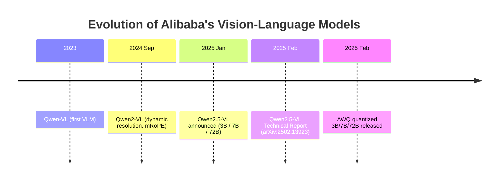
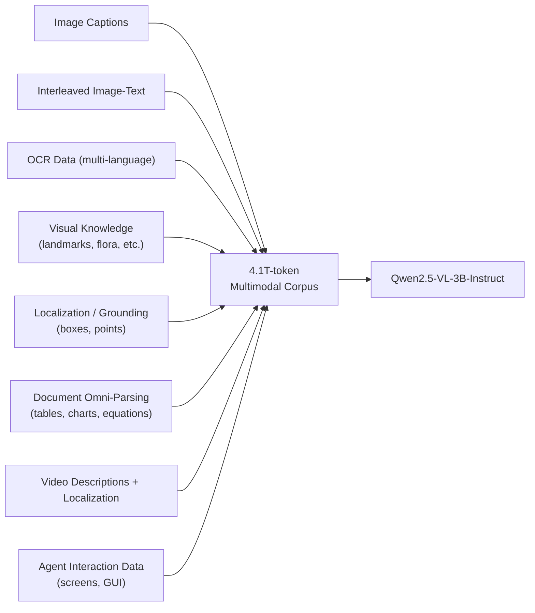
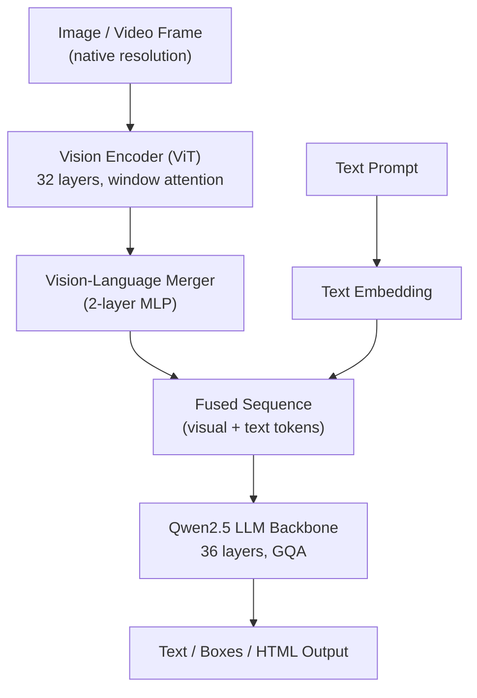
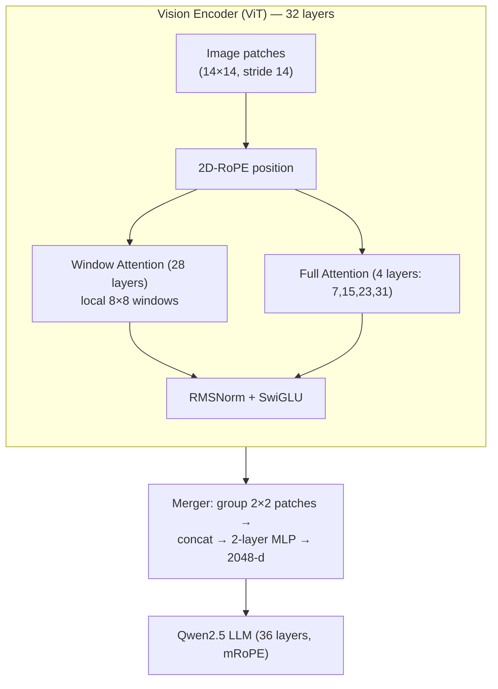
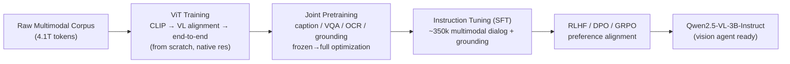
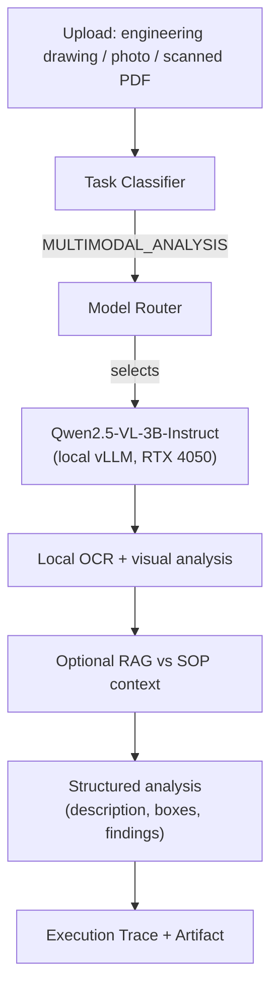

# Qwen2.5-VL-3B-Instruct --- Complete Reference

> A plain-English, friend-explainer guide to the vision-language model used in the Sovereign AI workbench (PS 26117).
> Everything below is sourced from the official Qwen2.5-VL model card, the Qwen2.5-VL Technical Report (arXiv:2502.13923), and Alibaba Cloud / Qwen Team documentation.

---

## 0. Words & Terms Your Team Mates Should Know (Read This First)

This document uses words from machine learning, computer vision, and software engineering. If a term below appears later, this is what it means in plain language. (Terms already explained in the coder doc are repeated here for convenience.)

| Term | Plain-English Meaning |
|---|---|
| **LLM (Large Language Model)** | An AI program that reads and writes text. Here it's the "brain" that reasons about what it sees. |
| **VLM (Vision-Language Model)** | A model that understands **both images/video AND text** — it can look at a picture and talk about it. |
| **Qwen / Qwen Team** | Alibaba's AI research group and the model brand. |
| **Alibaba Group** | The Chinese tech company that owns and released this model. |
| **Open-weight** | The model's internal numbers are published, so we can download and run it ourselves, offline. |
| **Instruct (vs Base)** | "Instruct" = additionally trained to follow human instructions / chat. "Base" = raw pretrained model. |
| **Parameter (param)** | One of the model's internal numbers. "3B" = 3 billion. |
| **Token** | A chunk of text (~¾ of a word). Text length is measured in tokens. |
| **Visual token** | A small piece of an image that the model "reads" instead of raw pixels (like words for pictures). |
| **Context length (32K)** | How much text+image the model can handle at once. 32K tokens ≈ 24,000 words. |
| **Pretraining** | First massive training step; the model learns general vision+language from trillions of tokens. |
| **Fine-tuning / Post-training** | Extra training on narrower data to improve a specific skill. |
| **Instruction tuning (SFT)** | Training on question→answer pairs so the model follows prompts. |
| **RLHF / DPO / GRPO** | Methods to make answers match human preference (Reinforcement Learning from Human Feedback; Direct Preference Optimization; Group Relative Policy Optimization). |
| **ViT (Vision Transformer)** | The "eyes" of the model — a neural network that turns an image into a grid of feature vectors. |
| **Patch** | A small square of an image (here 14×14 pixels) that the ViT processes as one unit. |
| **Window Attention** | A speed trick: the ViT only looks at nearby patches inside a local window, not the whole image at once (linear cost instead of quadratic). |
| **Full Attention** | Normal attention that can look at all patches. Only 4 layers in the ViT use this; the rest use window attention. |
| **RoPE (Rotary Position Embedding)** | Tells the model *where* things are using rotation math. |
| **2D-RoPE** | RoPE adapted for 2D image space (height + width). |
| **mRoPE (Multimodal RoPE)** | RoPE split into temporal + height + width components, so the model understands time, vertical, and horizontal position. |
| **Absolute time alignment** | For video, the model learns real timestamps (seconds), not just frame numbers. |
| **Dynamic resolution** | The model accepts images at their native size instead of forcing a fixed size. |
| **Dynamic FPS sampling** | For video, sampling frames at varying rates so the model understands videos of different speeds. |
| **Vision-Language Merger (MLP)** | A small network that compresses the ViT's image features and aligns them to the LLM's word space. |
| **GQA (Grouped Query Attention)** | Memory-saving attention trick; many query heads share few key/value heads. |
| **SwiGLU / RMSNorm** | Activation function and normalization used inside the model (also in the ViT here). |
| **Embedding tying** | Input and output word tables are shared to save memory (used in the 3B size). |
| **Quantization (AWQ / INT4 / INT8)** | Compressing the model to use less memory so it fits on a small GPU. |
| **OCR (Optical Character Recognition)** | Reading text out of images. |
| **Grounding / Bounding box** | The model locating an object in an image by drawing a box or point with real coordinates. |
| **Document omni-parsing** | Reading whole documents (tables, charts, equations, forms) and outputting structured HTML. |
| **Agent / GUI agent** | The model can "see" a screen and decide actions (like operating a computer or phone). |
| **vLLM** | Fast tool we use to serve the model locally. |
| **RTX 4050 (6 GB)** | The specific NVIDIA GPU in our server (6 GB video memory). |
| **Piston + Docker sandbox** | Isolated container where generated code runs safely, offline. |
| **Sovereign / Air-gapped** | Everything runs on our own hardware with no external cloud calls. |
| **PS 26117** | The internal project spec this model is used for. |
| **Apache 2.0** | A very permissive open-source license (allows commercial use). Qwen2.5-VL uses this. |

> Tip for teammates: scan this table first whenever you hit an unknown word.

---

## 1. TL;DR (for you and your friends)

- **What it is:** A small, open-weight, **vision-language model** that can see images/video and reason about them in text — read drawings, photos, scanned docs, handwritten notes.
- **Size:** ~3 billion parameters (the "3B" variant of the Qwen2.5-VL family).
- **Who made it:** The **Qwen Team at Alibaba Group**.
- **When:** Released **January 26, 2025**; technical report published **February 2025** (arXiv:2502.13923).
- **Why it's in our stack:** It is the **Vision model (VLM)** in `Better_plan.md` §2 — handles `MULTIMODAL_ANALYSIS` for engineering drawings, photos, and scanned documents, runs locally on the 6 GB RTX 4050, and crucially performs **local OCR and document parsing** for the air-gapped pipeline.
- **License:** **Apache 2.0** (fully open, including commercial use) — more permissive than the coder 3B's Qwen Research license.
- **VRAM:** ~5.75 GB at BF16, ~1.44 GB at INT4 — comfortably fits the 6 GB GPU, even alongside quantization planning.

---

## 2. A. Who Owns It

| Attribute | Detail |
|---|---|
| **Owner / Developer** | Alibaba Group — **Qwen Team** (QwenLM) |
| **Product line** | Qwen2.5 family (specialized "VL" vision-language expert) |
| **Repository** | Hugging Face: `Qwen/Qwen2.5-VL-3B-Instruct` |
| **Mirror** | ModelScope (Alibaba's model hub) |
| **License** | **Apache 2.0** |
| **Commercial use** | Allowed (permissive license) |
| **Sovereignty fit** | 100% open-weight; served fully offline via vLLM. No API calls to Alibaba at runtime. |

---

## 3. B. History — How It Evolved

Qwen2.5-VL is the third generation of Alibaba's vision-language models.



| Generation | Name | Notes |
|---|---|---|
| 1st | Qwen-VL | First vision-language model |
| 2nd | Qwen2-VL | Adds dynamic resolution + mRoPE; 1.2T tokens |
| 3rd | **Qwen2.5-VL** | New from-scratch ViT + window attention, **4.1T tokens**, absolute-time video, Apache 2.0 |

The "Instruct" suffix means this file is the **instruction-tuned** version, ready to follow commands and act as an agent tool (unlike `-Base`, which is for further fine-tuning).

---

## 4. C. Trained Data

The Qwen2.5-VL family was trained on approximately **4.1 trillion tokens** of multimodal data — up from 1.2T in Qwen2-VL.

### 4.1 Data Mixture (multimodal)



Key data categories:
- **Image captions & interleaved image-text** (cleaned/scored pipeline).
- **OCR data** — trained to support many languages (English, Chinese dominant; plus French, German, Italian, Spanish, Portuguese, Arabic, Russian, Japanese, Korean, Vietnamese, and more).
- **Visual knowledge** — celebrities, landmarks, animals/plants.
- **Grounding data** with **absolute position coordinates** (real image scale, not normalized) → better object detection/localization.
- **Document omni-parsing** — synthesized documents (tables, charts, equations, music sheets, chemical formulas) in HTML format.
- **Video data** — dynamic FPS sampling, second-level and hour-level timestamps.
- **Agent data** — screenshots from mobile, web, desktop for GUI-agent behavior.

The 3B model reuses the **same ViT and same data pipeline** as the 72B; only the LLM backbone and merger size differ.

---

## 5. D. Parameters & Architecture

### 5.1 Three-Part Architecture

Qwen2.5-VL is built from **three components**: a Vision Encoder (ViT), a Vision-Language Merger (MLP), and a Qwen2.5 LLM backbone.



### 5.2 Exact Specifications (3B size)

| Component | Property | Value (3B) |
|---|---|---|
| **Whole model** | Total Params | **~3 B** (AWQ-Int4 ≈ 1.35 B active) |
| | Context Length | **32,768 tokens** (extendable via YaRN) |
| | Trained Tokens | **4.1 T** |
| | Vocabulary | 151,646 |
| **Vision Encoder (ViT)** | Hidden Size | 1280 |
| | # Layers | 32 |
| | # Heads | 16 |
| | Intermediate Size | 3456 |
| | Patch Size | 14 |
| | Window Size | 112 (8×8 patches) |
| | Full-Attention Layers | {7, 15, 23, 31} (4 of 32) |
| | Positional Embedding | 2D-RoPE |
| | Norm / Act | RMSNorm / SwiGLU |
| **Merger (MLP)** | In Channel | 1280 |
| | Out Channel | **2048** (matches LLM hidden) |
| **LLM Backbone** | Architecture | Qwen2.5 (initialized from Qwen2.5 LLM) |
| | Hidden Size | **2048** |
| | # Layers | **36** |
| | # Query Heads | 16 (GQA) |
| | # KV Heads | **2** (GQA) |
| | Head Size | 128 |
| | Intermediate Size | 4864 |
| | Embedding Tying | **Yes** |
| | Positional Embedding | **mRoPE** (temporal + height + width, absolute-time aligned) |

### 5.3 Key Architectural Innovations

1. **From-scratch native-resolution ViT** — processes images at their real size; resizes height/width to multiples of 28, splits into 14×14 patches (stride 14).
2. **Window Attention** — 28 of 32 ViT layers use local windows (max 8×8 patches); only 4 evenly-spaced layers use full attention → near-linear compute cost. ViT also uses RMSNorm + SwiGLU (matching the LLM).
3. **Vision-Language Merger** — groups 2×2 adjacent patch features, concatenates, and projects via 2-layer MLP into the LLM's embedding dimension. This compresses long image sequences efficiently.
4. **mRoPE aligned to absolute time** — for video, temporal IDs map to real seconds, enabling second-level event localization in hour-long videos.
5. **Dynamic FPS sampling** — video frames sampled at varying rates so the model understands different playback speeds.



### 5.4 Special Tokens

| Token | Purpose |
|---|---|
| `<|vision_start|>` / `<|vision_end|>` | Mark the visual input region |
| `<|image_pad|>` | Placeholder expanded to the image's visual tokens |
| `<|video_pad|>` | Placeholder expanded to the video's visual tokens |
| `<|im_start|>` / `<|im_end|>` | Chat template markers |

### 5.5 Comparison Across the Family

| Size | LLM Hidden | LLM Layers | KV Heads | Merger Out | Context | License |
|---|---|---|---|---|---|---|
| **3B** | 2048 | **36** | 2 | 2048 | 32K | **Apache 2.0** |
| 7B | 3584 | 28 | 4 | 3584 | 32K+ | Apache 2.0 |
| 72B | 8192 | 80 | 8 | 8192 | 32K+ | Apache 2.0 |

Note: the 7B model has *fewer but wider* layers than the 3B — a different depth/width trade-off in the Qwen2.5 design.

---

## 6. Training Pipeline



Staged training:
1. **ViT from scratch** — CLIP pretraining, vision-language alignment, end-to-end fine-tuning at native resolutions (dynamic sampling by aspect ratio).
2. **Multi-task joint pretraining** — captioning, VQA, OCR, grounding, with rising resolution.
3. **Supervised multimodal instruction tuning** — high-quality dialog + grounding (~350k samples), LLM-generated and human-annotated.
4. **Preference alignment** — RLHF/DPO/GRPO to match human preferences and improve instruction adherence.

---

## 7. Capabilities & Benchmarks

The 3B model is explicitly positioned as an **edge-AI** solution and, per the Qwen team, even outperforms the previous 7B (Qwen2-VL-7B) on several tasks.

| Capability | What it means for us |
|---|---|
| **Image captioning / VQA** | Describe or answer questions about an uploaded image |
| **Visual grounding** | Return bounding boxes / points with real coordinates |
| **OCR (multi-language)** | Read text from scans, photos, and drawings — **local, no cloud OCR needed** |
| **Document omni-parsing** | Extract tables, charts, equations, forms → structured HTML |
| **Engineering drawing analysis** | Understand dimensions, components, compliance notes (our Demo 3) |
| **Video comprehension** | Understand hours-long video with second-level event localization |
| **GUI / visual agent** | "See" a screen and reason about actions |

Representative 3B benchmark scores (BF16 → AWQ-Int4):

| Benchmark | 3B BF16 | 3B AWQ-Int4 |
|---|---|---|
| MMMU (college-level) | 51.7 | 49.1 |
| DocVQA (document QA) | 93.0 | 91.8 |
| MMBench (general) | 79.8 | 78.0 |
| MathVista (math in images) | 61.4 | 58.8 |

---

## 8. Deployment in the Sovereign AI Stack

In `Better_plan.md`, this model is the **Vision model (VLM)** selected for `MULTIMODAL_ANALYSIS` (engineering drawings, photos, scanned documents).



### 8.1 Hardware Fit (RTX 4050, 6 GB)

| Precision | VRAM needed |
|---|---|
| FP32 | 11.5 GB |
| **BF16** | **5.75 GB** |
| INT8 | 2.87 GB |
| **INT4 (AWQ)** | **1.44 GB** |

The model fits the 6 GB GPU even at BF16, leaving headroom. With INT4/AWQ it is tiny, allowing the coder/general model to be swapped in as needed (per `Better_plan.md` §3.7, one model runs at a time).

### 8.2 Why It Satisfies Sovereignty

- Open-weight → download once, serve offline via vLLM.
- Performs **local OCR and document parsing**, replacing cloud OCR services (a hard requirement in §12.3: "NO CLOUD OCR").
- The **network monitor** in the UI will still show `External AI API calls: 0` while this model "looks" at images.

---

## 9. Quick Facts Card (shareable)

```
Model:        Qwen2.5-VL-3B-Instruct
Owner:        Alibaba Group — Qwen Team
License:      Apache 2.0 (commercial OK)
Params:       ~3B total (1.35B active in AWQ-Int4)
Components:   ViT (32L) + MLP Merger + Qwen2.5 LLM (36L, GQA 16/2)
Context:      32,768 tokens (YaRN-extendable)
Trained on:   4.1T multimodal tokens
Vision:       Native-resolution ViT, window attention, 2D-RoPE
Positioning:  mRoPE aligned to absolute time (video), dynamic FPS
Languages:    Multi-language (EN/ZH + many others)
VRAM (BF16):  5.75 GB  → fits RTX 4050
Role in PS:   Vision model for MULTIMODAL_ANALYSIS
```

---

## 10. References

- Model card: https://huggingface.co/Qwen/Qwen2.5-VL-3B-Instruct
- Technical Report: Bai et al., *Qwen2.5-VL Technical Report*, arXiv:2502.13923 (2025)
- Announcement blog: https://qwenlm.github.io/blog/qwen2.5-vl/
- GitHub: https://github.com/QwenLM/Qwen2.5-VL
- AWQ quantized 3B: https://huggingface.co/Qwen/Qwen2.5-VL-3B-Instruct-AWQ
