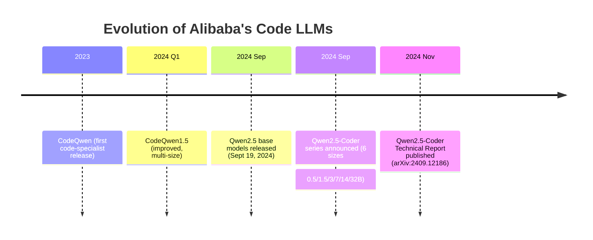
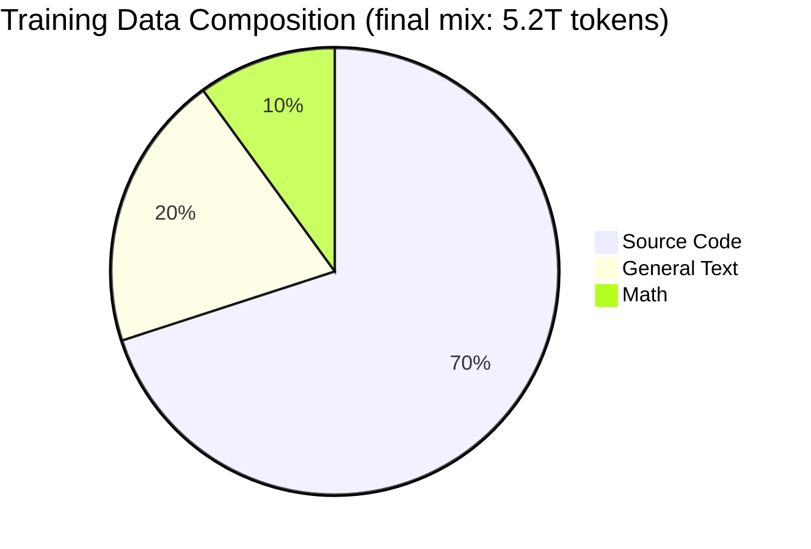
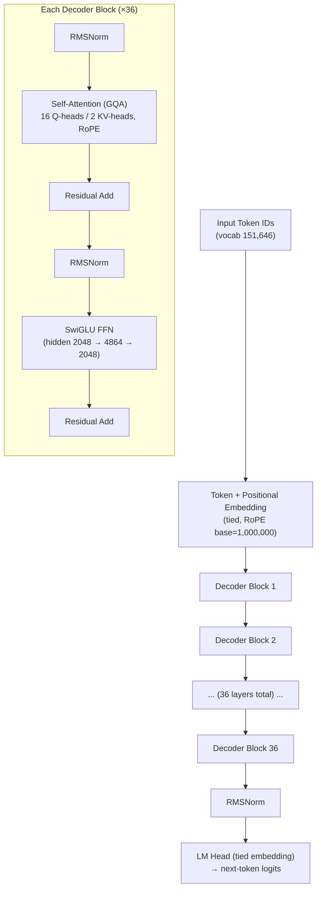
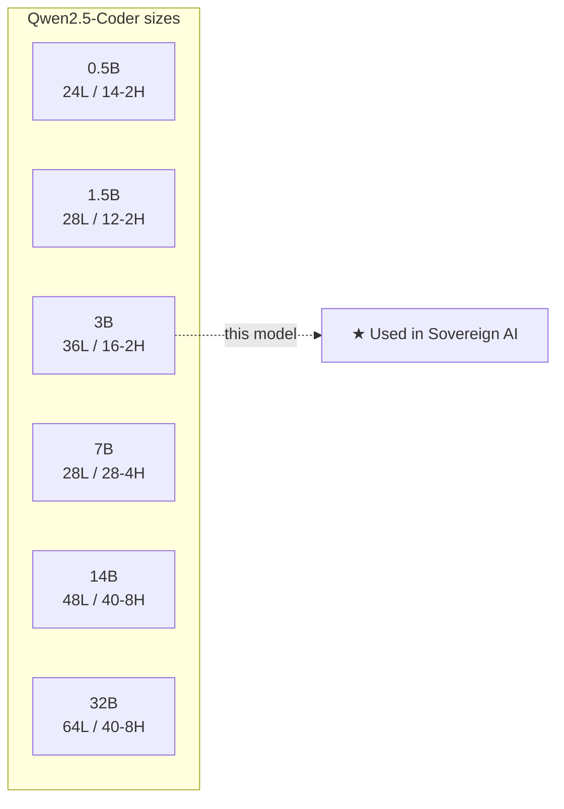
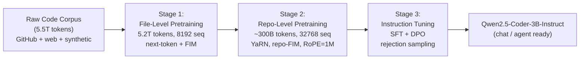
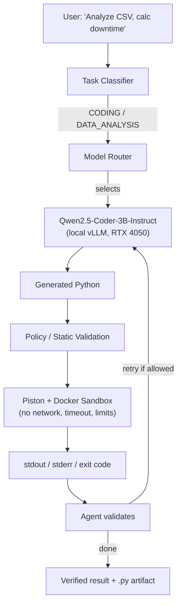

# Qwen2.5-Coder-3B-Instruct --- Complete Reference

> A plain-English, friend-explainer guide to the coding model used in the Sovereign AI workbench (PS 26117).
> Everything below is sourced from the official Qwen2.5-Coder model card, the Qwen2.5-Coder Technical Report (arXiv:2409.12186), and Alibaba Cloud documentation.

---

## 0. Words & Terms Your Team Mates Should Know (Read This First)

This document uses words from machine learning and software engineering. If a term below appears later in the document, this is what it means in plain language.

| Term | Plain-English Meaning |
|---|---|
| **LLM (Large Language Model)** | An AI program that reads and writes text (and code). Think of it as an "autocomplete on steroids" trained on huge amounts of text. |
| **Qwen / Qwen Team** | The name of Alibaba's AI research group and the brand of their models. "Qwen" is pronounced like "kwen". |
| **Alibaba Group** | The Chinese tech company that owns and released this model. |
| **Open-weight** | The model's internal numbers (weights) are published, so we can download and run it ourselves — instead of paying a company to use it through the internet. |
| **Instruct (vs Base)** | "Instruct" means the model was additionally trained to follow human instructions / chat. "Base" is the raw pretrained model meant for developers to fine-tune. |
| **Parameter (param)** | One of the model's internal numbers it uses to make predictions. "3B" = 3 billion such numbers. More is not always better; this one is small and efficient. |
| **Token** | A chunk of text — roughly 4 characters or ¾ of a word in English. Models measure text length in tokens, not words. |
| **Context length (32K / 128K)** | How much text the model can "see" at once. 32K tokens ≈ 24,000 words; 128K ≈ 100,000 words. |
| **Pretraining** | The first, massive training step where the model learns general language/code by predicting the next token across trillions of tokens. |
| **Fine-tuning / Post-training** | Additional training on a narrower dataset to make the model better at a specific job (here: following coding instructions). |
| **Instruction tuning (SFT)** | Teaching the model to answer prompts like "write a Python function that…" using example question→answer pairs. |
| **DPO (Direct Preference Optimization)** | A method to make the model's answers match what humans prefer, by training on "this answer is better than that one" pairs. |
| **FIM (Fill-in-the-Middle)** | A trick where you give the model the start and end of some code and it fills in the missing middle part. |
| **RoPE (Rotary Position Embedding)** | A technique that tells the model *where* each word is in a sentence using rotation math, helping it handle long text. |
| **YaRN** | A method that lets a model read longer texts than it originally trained for, without breaking. |
| **GQA (Grouped Query Attention)** | A memory-saving trick in the attention mechanism; many "question" heads share a few "key/value" heads. Keeps the model small and fast. |
| **SwiGLU** | A type of "activation function" — the mathematical step inside the model that adds non-linearity so it can learn complex patterns. |
| **RMSNorm** | A way to normalize numbers inside the model so training and inference stay stable. |
| **Attention heads** | Parallel "focus" channels inside the model that each look at different relationships in the text. |
| **Embedding / Tied embedding** | The lookup table that turns words into numbers (and back). "Tied" means the input and output tables are shared to save memory. |
| **Vocabulary size (151,646)** | How many distinct tokens the model knows. |
| **Causal Language Model** | A model that predicts the next token from previous tokens only (left-to-right), like standard text generation. |
| **Decoder-only / Dense** | The model only uses the "decoder" half of a Transformer and is "dense" (all parameters active), unlike "Mixture-of-Experts" models. |
| **Transformer** | The underlying neural network architecture (introduced by Google in 2017) that nearly all modern LLMs are built on. |
| **Synthetic data** | Data artificially generated by another AI model, used to train/improve this one. |
| **Benchmark** | A standardized test (e.g., code-generation accuracy) used to compare models fairly. |
| **vLLM** | A fast, open-source tool we use to run (serve) this model on our own machine. |
| **RTX 4050 (6 GB)** | The specific NVIDIA graphics card in our server; it has 6 GB of video memory, which limits model size. |
| **Quantization (AWQ / GPTQ / GGUF / INT4)** | Compressing the model's numbers to use less memory (like zipping), so it fits on a small GPU. Slightly less precise but much lighter. |
| **Piston + Docker sandbox** | An isolated, disposable container where generated code runs safely without touching our real system or the internet. |
| **Sovereign / Air-gapped** | Running everything on our own hardware with no connection to external cloud AI services — for confidentiality. |
| **PS 26117** | The internal project spec (Problem Statement) this model is being used for. |
| **Apache 2.0 vs Qwen Research License** | Two different permission sets. Apache 2.0 is very open; the 3B model uses the more restricted "Qwen Research" license — read it before commercial use. |

> Tip for teammates: whenever you see a word you don't know, scan this table first. The rest of the document is written assuming you've read it.

---

## 1. TL;DR (for you and your friends)

- **What it is:** A small, open-weight, *code-specialist* language model that can read, write, debug, and reason about code.
- **Size:** ~3.09 billion parameters (2.77B without the embedding tables).
- **Who made it:** The **Qwen Team at Alibaba Group** (the same lab behind the Qwen family of models).
- **When:** Announced **September 2024**; technical report published **November 2024**.
- **Why it's in our stack:** It runs on a single 6 GB RTX 4050 GPU, is fully local, and is purpose-built for code generation, data-analysis scripts, and calculations — exactly the `CODING`, `DATA_ANALYSIS`, and `CALCULATION` task classes in `Better_plan.md`.
- **License:** The 3B variant is released under the **Qwen Research License** (permissive for research/most uses, but *not* the fully open Apache 2.0 that the 0.5B/1.5B/7B/14B/32B sizes use). Check the license terms before any commercial deployment.

---

## 2. A. Who Owns It

| Attribute | Detail |
|---|---|
| **Owner / Developer** | Alibaba Group — **Qwen Team** (also written as QwenLM) |
| **Product line** | Qwen2.5 family (specialized "Coder" expert model) |
| **Repository** | Hugging Face: `Qwen/Qwen2.5-Coder-3B-Instruct` |
| **Mirror** | ModelScope (Alibaba's model hub) |
| **License** | **Qwen Research License** (the 3B size specifically) |
| **Commercial use** | Allowed under the research license with constraints — review the license text before shipping commercially |
| **Sovereignty fit** | 100% open-weight, can be downloaded once and served fully offline via vLLM. No API calls to Alibaba at runtime. |

> **Note for the Sovereign AI project:** Because it is open-weight, we serve it locally through vLLM. At inference time it makes **zero** external calls, which is exactly what the network monitor in `Better_plan.md` must prove.

---

## 3. B. History — How It Evolved

The model is the third generation of Alibaba's code-focused LLMs.



**Lineage at a glance:**

| Generation | Name | Notes |
|---|---|---|
| 1st | CodeQwen | Original code model |
| 2nd | CodeQwen1.5 | Multi-size, stronger base |
| 3rd | **Qwen2.5-Coder** | Built on Qwen2.5 architecture, trained on **5.5 trillion tokens**, adds FIM + repo-level context, 92 languages |

The "Instruct" suffix means this particular file is the **instruction-tuned** version (post-training on coding instructions), so it is ready to chat, follow commands, and act as an agent tool — unlike the `-Base` variant which is meant for further fine-tuning or code completion.

---

## 4. C. Trained Data

The training corpus is called **`Qwen2.5-Coder-Data`** and totals **over 5.5 trillion tokens** (5.2T used in file-level pretraining alone).

### 4.1 The Five Data Types



| Data Type | What it contains | Source |
|---|---|---|
| **Source Code** (70%) | Public GitHub repos, pull requests, commits, Jupyter notebooks across **92 programming languages** | GitHub, web crawl |
| **Text Data** (20%) | High-quality general natural-language text inherited from Qwen2.5 | Qwen2.5 pretraining corpus |
| **Math Data** (10%) | Mathematical reasoning data | Qwen2.5-Math corpus |
| **Text-Code Grounding** | Pairs linking natural language to code (docs, comments, explanations) | Synthesized + crawled |
| **Synthetic Data** | Large-scale LLM-generated code problems/solutions used for instruction tuning | Code LLM generation + LLM scoring/filtering |

### 4.2 Why 70 / 20 / 10?

The team empirically found that a **70% code / 20% text / 10% math** ratio beat even mixes with *more* code. Their hypothesis: math and text data help coding ability, but only once they pass a certain concentration threshold.

### 4.3 Data Cleaning

- Weak-model classifiers and scorers filter low-quality content.
- File-level and repository-level cleaning ensures coherent context.
- Synthetic instruction data is filtered by an LLM scorer to keep only high-quality pairs.

---

## 5. D. Parameters & Architecture

### 5.1 Exact Specifications (3B size)

| Property | Value |
|---|---|
| Total Parameters | **3.09 B** |
| Non-Embedding Parameters | **2.77 B** |
| Layers | **36** |
| Query Attention Heads | **16** (GQA) |
| KV Attention Heads | **2** (GQA) |
| Head Size | 128 |
| Hidden Size | 2048 |
| Intermediate Size (FFN) | 4864 |
| Vocabulary Size | 151,646 |
| Embedding Tying | **Yes** (shared input/output embeddings) |
| Context Length (native) | **32,768 tokens** |
| Context Length (extended) | up to **131,072 (128K)** via YaRN |
| Model Type | Causal Language Model (decoder-only, dense) |
| Precision | BF16 weights (~5.0 GB + 1.2 GB shards = ~6.2 GB VRAM at inference) |

### 5.2 Architecture Building Blocks

The architecture is inherited directly from **Qwen2.5**. Key components:

- **RoPE** (Rotary Position Embedding) — with base frequency raised to **1,000,000** for long context.
- **SwiGLU** activation in the feed-forward network.
- **RMSNorm** for normalization (pre-normalization).
- **Attention QKV bias** present.
- **Grouped Query Attention (GQA)** — 16 Q heads share 2 KV heads (saves memory, speeds inference).
- **Tied word embeddings** (input = output embedding matrix).
- **Fill-in-the-Middle (FIM)** support via special tokens.



### 5.3 Special Tokens (important for code)

Qwen2.5-Coder adds code-specific tokens on top of Qwen2.5's vocabulary:

| Token | ID | Purpose |
|---|---|---|
| `<|fim_prefix|>` | 151659 | Fill-in-the-Middle prefix |
| `<|fim_middle|>` | 151660 | FIM middle (the part to predict) |
| `<|fim_suffix|>` | 151661 | FIM suffix |
| `<|fim_pad|>` | 151662 | FIM padding |
| `<|repo_name|>` | 151663 | Repository name marker |
| `<|file_sep|>` | 151664 | File separator (repo-level context) |
| `<|im_start|>` / `<|im_end|>` | 151644 / 151645 | Chat template markers |

### 5.4 Comparison Across the Family



| Size | Params | Layers | Q/KV Heads | Tied Emb. | Context | License |
|---|---|---|---|---|---|---|
| 0.5B | 0.49B | 24 | 14 / 2 | Yes | 32K | Apache 2.0 |
| 1.5B | 1.54B | 28 | 12 / 2 | Yes | 32K | Apache 2.0 |
| **3B** | **3.09B** | **36** | **16 / 2** | **Yes** | **32K** | **Qwen Research** |
| 7B | 7.61B | 28 | 28 / 4 | No | 128K | Apache 2.0 |
| 14B | 14.7B | 48 | 40 / 8 | No | 128K | Apache 2.0 |
| 32B | 32.5B | 64 | 40 / 8 | No | 128K | Apache 2.0 |

---

## 6. Training Pipeline (Three Stages)



1. **File-Level Pretraining** — learns from individual code files; objective is next-token prediction + Fill-in-the-Middle (FIM). Max sequence 8,192 tokens.
2. **Repo-Level Pretraining** — extends context to 32,768 tokens, raises RoPE base frequency 10,000 → 1,000,000, applies **YaRN** for extrapolation up to 128K. Uses ~300B long-context code tokens.
3. **Instruction Tuning** — two phases: (a) tens of millions of diverse synthetic instruction samples, then (b) millions of high-quality samples refined via rejection sampling + supervised fine-tuning, plus **DPO (Direct Preference Optimization)** to align with human preference.

---

## 7. Performance & Capabilities

- **Benchmarks:** State-of-the-art among open code LLMs at its size; the 32B sibling matches GPT-4o on coding. The 3B is competitive with much larger models on code tasks.
- **Languages:** 92 programming languages supported.
- **Strengths:** code generation, code completion (FIM), code reasoning, code fixing/debugging, and math-adjacent logic.
- **Retained skills:** Keeps general-language and math ability thanks to the 20% text + 10% math mix.

---

## 8. Deployment in the Sovereign AI Stack

In `Better_plan.md`, this model is the **Coding LLM** selected for `CODING`, `DATA_ANALYSIS`, and `CALCULATION` tasks.



### 8.1 Hardware Fit (RTX 4050, 6 GB)

| Variant | VRAM needed | Notes |
|---|---|---|
| BF16 (default) | ~6.2 GB | Fits, but tight on 6 GB |
| **AWQ / GPTQ-Int4** | ~2–3 GB | Recommended for 6 GB GPU |
| GGUF (Q4) | ~2.5 GB | CPU/GPU flexible |

Because the GPU can only run one model at a time (per `Better_plan.md` §3.7), the 3B coder is loaded on demand and swapped with the general/vision models as needed.

### 8.2 Why It Satisfies Sovereignty

- Open-weight → download once, serve offline.
- vLLM OpenAI-compatible endpoint is local only.
- The generated code is executed inside **Piston + Docker** with **network disabled**, so even the sandbox cannot phone home.
- The **network monitor** in the UI will show `External AI API calls: 0` while this model answers.

---

## 9. Quick Facts Card (shareable)

```
Model:        Qwen2.5-Coder-3B-Instruct
Owner:        Alibaba Group — Qwen Team
License:      Qwen Research License (3B size)
Params:       3.09B total / 2.77B non-embedding
Layers:       36  |  Heads: 16Q / 2KV (GQA)
Context:      32,768 tokens (up to 128K w/ YaRN)
Languages:    92
Training:     5.5T tokens (70% code / 20% text / 10% math)
VRAM (BF16):  ~6.2 GB  → fits RTX 4050 with quantization
Role in PS:   Coding LLM for CODING / DATA_ANALYSIS / CALCULATION
```

---

## 10. References

- Model card: https://huggingface.co/Qwen/Qwen2.5-Coder-3B-Instruct
- Technical Report: Hui et al., *Qwen2.5-Coder Technical Report*, arXiv:2409.12186 (2024)
- Alibaba Cloud blog: https://www.alibabacloud.com/blog/qwen2-5-coder-series-powerful-diverse-practical_601765
- Qwen2.5 announcement: https://qwenlm.github.io/blog/qwen2.5/
- License terms: see the `LICENSE` file in the Hugging Face repo (Qwen Research License for the 3B size)
