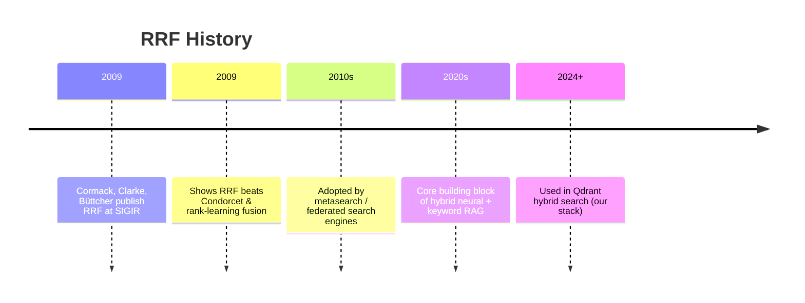
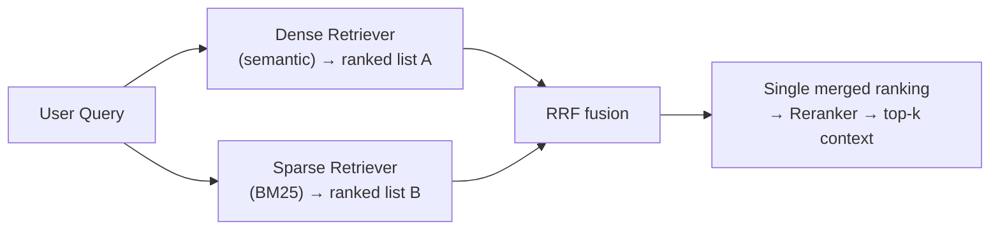
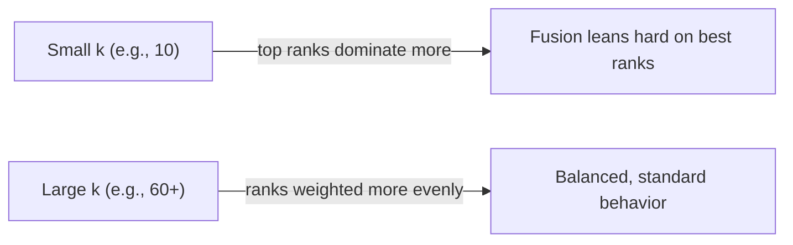
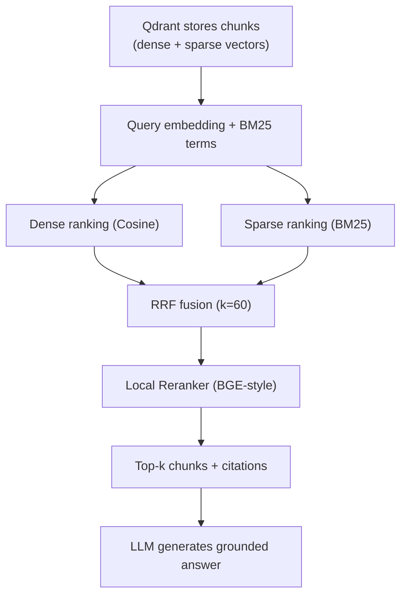

# RRF --- Reciprocal Rank Fusion --- Complete Reference

> A plain-English, friend-explainer guide to the Reciprocal Rank Fusion algorithm used in the Sovereign AI workbench (PS 26117) for hybrid RAG retrieval.
> Sources: the original SIGIR 2009 paper by Cormack, Clarke & Büttcher, and standard retrieval-engineering practice (incl. Qdrant's hybrid-search docs).

---

## 0. Words & Terms Your Team Mates Should Know (Read This First)

RRF is not a model or a tool — it is a **formula** that combines several ranked lists into one. These terms explain it.

| Term | Plain-English Meaning |
|---|---|
| **RRF** | Reciprocal Rank Fusion — a way to merge several ranked result lists into one. |
| **Rank / Ranking** | An ordered list of results, best first (rank 1 = best). |
| **Retrieval system** | A search method that returns a ranked list (e.g., dense semantic search, BM25 keyword search). |
| **Dense retrieval** | Search by meaning using embeddings (semantic). Returns a ranked list. |
| **Sparse retrieval (BM25)** | Keyword search. Also returns a ranked list. |
| **Score vs Rank** | A *score* is a raw number (hard to compare across systems); a *rank* is a position (1st, 2nd…) which is easy to compare. |
| **Fusion / Merging** | Combining multiple ranked lists into a single best list. |
| **Reciprocal** | "1 divided by" — RRF uses `1 / rank`, so higher ranks contribute less. |
| **k (constant)** | A smoothing number added to the rank so rank 1 doesn't dominate too extremely. Common default = 60. |
| **Normalization** | Rescaling scores to a common range. RRF avoids needing this. |
| **Hybrid search** | Using more than one retrieval method and fusing their results. |
| **Reranker** | A later model that re-orders the fused results for even better relevance. |
| **Qdrant** | Our vector DB that actually performs RRF over dense + sparse results. |
| **RAG** | Retrieval-Augmented Generation — fetch relevant context, then answer. |
| **PS 26117** | The internal project spec this algorithm is used for. |

> Tip for teammates: scan this table first whenever you hit an unknown word.

---

## 1. TL;DR (for you and your friends)

- **What it is:** A simple, battle-tested formula that **merges several ranked search results into one ranked list**.
- **Why it's in our stack:** `Better_plan.md` §2/§8 uses **RRF** to combine the **dense (semantic)** and **sparse (BM25 keyword)** retrieval rankings from Qdrant into a single hybrid result list before reranking.
- **Who invented it:** **Cormack, Clarke, and Büttcher** (University of Waterloo) in **2009**.
- **License:** It's a published algorithm (no license / public method) — free to use.
- **Key idea:** Use each item's **rank position** (not its raw score), so different systems can be combined without score normalization.
- **Sovereignty note:** Pure math, runs 100% locally inside our backend — no external calls.

---

## 2. A. Who "Owns" It

RRF is an **open academic algorithm**, not a product.

| Attribute | Detail |
|---|---|
| **Authors** | Gordon V. Cormack, Charles L. A. Clarke, Stefan Büttcher |
| **Institution** | University of Waterloo, Canada |
| **Published** | SIGIR 2009 — *"Reciprocal Rank Fusion outperforms Condorcet and individual Rank Learning Methods"* |
| **Status** | Public method, no proprietary owner, freely usable |
| **Used by** | Elasticsearch, OpenSearch, Qdrant, and most modern hybrid RAG pipelines |

---

## 3. B. History — How It Came To Be



Before RRF, combining results from different search systems was hard because their scores lived on different scales (a BM25 score of 12 vs a cosine score of 0.83 can't be directly added). RRF sidesteps this by using **rank position only**.

---

## 4. C. What It Does / Why We Need It

In our RAG pipeline we run **two** retrievers on the same query:
1. **Dense** (semantic) search → ranked list A.
2. **Sparse** (BM25 keyword) search → ranked list B.

We want **one** combined list that benefits from both "understanding meaning" and "exact keyword match". RRF does exactly that.



---

## 5. D. How It Works (The Math + Architecture)

### 5.1 The Formula

For each document `d`, RRF computes a fused score by summing `1 / (k + rank)` over every ranked list that contains `d`:

```
            Σ       1
RRF(d) =  ───────      ─────────────
         r ∈ R(d)   (k + rank_r(d))
```

Where:
- `R(d)` = the set of rankings (retrievers) that returned document `d`.
- `rank_r(d)` = the position of `d` in ranking `r` (1 = best).
- `k` = a constant (smoothing), commonly **60**.

Documents are then sorted by `RRF(d)` descending.

### 5.2 Worked Example

Suppose `k = 60`. Two retrievers return a document "SOP_p17":

| Retriever | Rank of SOP_p17 | Contribution = 1/(60 + rank) |
|---|---|---|
| Dense | 3 | 1 / 63 ≈ 0.01587 |
| Sparse (BM25) | 1 | 1 / 61 ≈ 0.01639 |
| **RRF total** | | **≈ 0.03226** |

A doc ranked #1 by both would get `1/61 + 1/61 ≈ 0.03279` — slightly higher. A doc ranked #100 by one retriever still adds a tiny `1/160 ≈ 0.00625`, so it isn't erased.

### 5.3 Why `k` Matters



Larger `k` softens the penalty for lower ranks; `k = 60` is the widely used default (and Qdrant's default).

### 5.4 Why RRF Is Better Than Alternatives

| Approach | Problem |
|---|---|
| Score averaging | Needs score normalization across systems (hard, lossy). |
| Min/max score | Sensitive to outliers and scale. |
| **RRF** | Uses only ranks → **no normalization needed**, robust, simple. |

The 2009 paper showed RRF beats Condorcet fusion and individual rank-learning methods.

### 5.5 Where RRF Sits in Our Pipeline



RRF is the **fusion step**; the reranker afterward fine-tunes relevance. This two-stage design matches `Better_plan.md` §2 ("RRF" + "Local reranker").

---

## 6. Deployment in the Sovereign AI Stack

In `Better_plan.md`, RRF is referenced in §2 (Fusion layer) and §8 (RAG pipeline): *"Qdrant → RRF → Reranker → Context"*.

### 6.1 Configuration Notes

| Setting | Recommendation |
|---|---|
| `k` | 60 (default; tune 10–100 if needed) |
| Inputs | Dense ranking + Sparse (BM25) ranking (can add more, e.g., correspondence-specific) |
| Output | Single fused ranking, truncated to top-N (e.g., 50) for the reranker |
| Location | Computed inside the backend RAG service / Qdrant hybrid query — **fully local** |

### 6.2 Why It Satisfies Sovereignty

- RRF is just arithmetic — no model, no network, no external service.
- Runs inside our backend; the **network monitor** still shows `External AI API calls: 0`.

---

## 7. Quick Facts Card (shareable)

```
Algorithm:   Reciprocal Rank Fusion (RRF)
Authors:     Cormack, Clarke, Büttcher (U. Waterloo)
Published:   SIGIR 2009
Formula:     Σ 1 / (k + rank),  k ≈ 60
Input:       Two+ ranked lists (dense + sparse)
Output:      One merged ranking
Why use it:  No score normalization needed; robust
Role in PS:  Hybrid RAG fusion step (before reranker)
Sovereign:   Pure local math, no external calls
```

---

## 8. References

- Cormack, Clarke, Büttcher (2009), *Reciprocal Rank Fusion outperforms Condorcet and individual Rank Learning Methods*, SIGIR 2009.
- Qdrant Hybrid Search docs: https://qdrant.tech/documentation/concepts/hybrid-search/
- Background: metasearch / data fusion literature (Condorcet fusion, Borda count).
